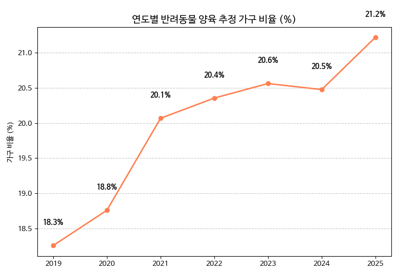
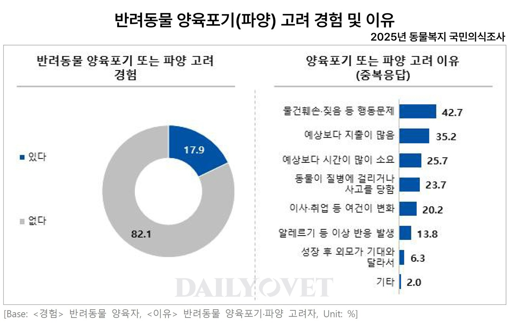
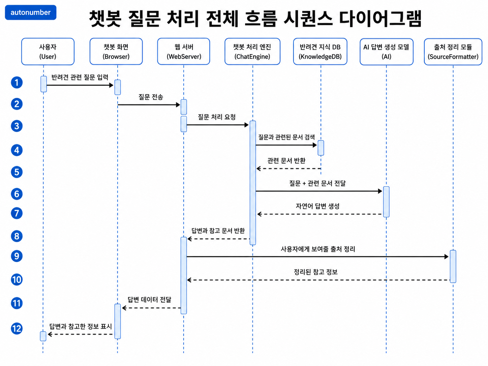
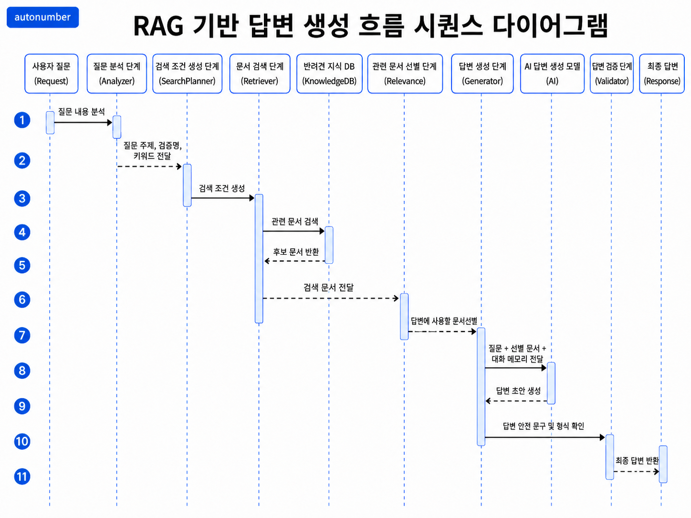

---
marp: true
title: 반려견 케어 Q&A 서비스 Pet Mate
theme: petmate-template
paginate: true
size: 16:9
header: Pet Mate
footer: NewDogs | AI 반려견 케어 Q&A 서비스
style: |
  /* @theme petmate-template */
  @import url('https://cdn.jsdelivr.net/gh/webfontworld/pretendard/Pretendard.css');

  :root{
    --deep:#466456;
    --deep-2:#344b40;
    --sage:#6A7E74;
    --mint:#BACCC3;
    --paper:#F8F7F5;
    --soft:#EEF4F1;
    --white:#FFFFFF;
    --ink:#222222;
    --muted:#6B766F;
    --line:#D8E1DD;
    --shadow:0 14px 30px rgba(34,34,34,.06);
  }

  section{
    font-family: Pretendard, "Noto Sans KR", "Apple SD Gothic Neo", "Malgun Gothic", sans-serif;
    background: var(--paper);
    color: var(--ink);
    padding: 92px 70px 72px 70px;
    letter-spacing: 0;
    border: 1px solid #E3DFD8;
    border-radius: 18px;
    overflow: hidden;
    box-sizing: border-box;
  }

  section::before{
    content:"";
    position:absolute;
    top:0; left:0; right:0;
    height:42px;
    background: var(--deep);
    z-index:0;
  }

  header{
    position:absolute;
    top:14px;
    right:72px;
    left:auto !important;
    font-weight:900;
    letter-spacing:.02em;
    color: #fff;
    font-size: 13px;
    z-index: 10;
  }
  header::before{
    content:"PROJECT CASE STUDY";
    position:fixed;
    left:70px;
    top:14px;
    font-size:11px;
    font-weight:800;
    color:rgba(255,255,255,.82);
    letter-spacing:.11em;
  }
  footer{
    position:absolute;
    left:70px;
    bottom:34px;
    font-size: 11px;
    color: rgba(70,100,86,.72);
    letter-spacing:.01em;
  }
  section::after{
    left:30px;
    right:auto;
    bottom:24px;
    color:#fff;
    background: rgba(34,34,34,.70);
    padding: 6px 11px;
    border-radius: 999px;
    font-weight:900;
    font-size: 14px;
    min-width: 34px;
    text-align:center;
  }

  h1{
    color: var(--deep);
    font-size: 44px;
    font-weight: 900;
    line-height: 1.12;
    margin: 0 0 24px 0;
    letter-spacing:0;
    text-align:center;
  }
  h1::after{
    content:"";
    display:block;
    height:2px;
    margin:22px 0 0 0;
    background:var(--mint);
  }
  h2{ font-size: 23px; margin: 0 0 12px 0; color: var(--deep); font-weight:900; letter-spacing:0; }
  h3{ color:var(--deep); letter-spacing:0; }
  p, li{ font-size: 19px; line-height: 1.48; letter-spacing:0; word-break:keep-all; }
  ul{ margin: 10px 0 0 0; }
  li{ margin: 7px 0; }
  small{ color: var(--muted); }

  section.banded{
    background:
      linear-gradient(to bottom, rgba(186,204,195,.24) 42px, transparent 42px),
      var(--paper);
    padding-top: 78px;
  }
  section.banded > h1{
    position:relative;
    top:auto;
    left:auto;
    margin:0;
    color: var(--deep);
    font-size: 42px;
    font-weight: 900;
    text-align:left;
    width:100%;
  }
  section.banded > h1::after{
    margin-top:18px;
  }

  .grid{ display:grid; gap:18px; }
  .grid-2{ display:grid; grid-template-columns: 1fr 1fr; gap: 18px; }
  .grid-3{ display:grid; grid-template-columns: 1fr 1fr 1fr; gap: 18px; }
  .grid-4{ display:grid; grid-template-columns: repeat(4, 1fr); gap: 14px; }

  .card{
    background: var(--white);
    border: 1px solid var(--line);
    border-radius: 10px;
    overflow:hidden;
    box-shadow: var(--shadow);
  }
  .card .bar{
    background: var(--deep);
    color:#fff;
    padding: 11px 16px;
    font-weight: 900;
    font-size: 16px;
    letter-spacing:.02em;
  }
  .card .body{
    padding: 16px 18px 18px 18px;
    font-size: 18px;
    color: var(--ink);
  }
  .card.accent .bar{ background: var(--sage); }
  .card.gold .bar{ background: var(--mint); color: var(--deep-2); }

  .badge{
    display:inline-block;
    padding: 4px 10px;
    border-radius: 999px;
    background: rgba(186,204,195,.48);
    color: var(--deep);
    font-weight: 900;
    font-size: 14px;
    letter-spacing:.06em;
  }

  table{
    width:100%;
    border-collapse:collapse;
    background:#fff;
    border-radius:10px;
    overflow:hidden;
    font-size:15px;
    box-shadow:var(--shadow);
  }
  th{
    background:var(--deep);
    color:#fff;
    font-weight:900;
  }
  th,td{
    border:1px solid rgba(106,126,116,.18);
    padding:9px 11px;
    line-height:1.35;
  }

  .metric{
    background:#fff;
    border:1px solid var(--line);
    border-radius:10px;
    padding:20px 18px;
    box-shadow: var(--shadow);
    text-align:center;
  }
  .metric .num{
    font-size:40px;
    font-weight:900;
    color:var(--deep);
    line-height:1;
  }
  .metric .label{
    margin-top:8px;
    font-size:16px;
    font-weight:800;
    color:var(--sage);
  }
  .stat-row{
    display:grid;
    grid-template-columns:70px 1fr;
    gap:8px;
    align-items:center;
    margin:6px 0;
  }
  .stat-label{
    font-size:12px;
    color:var(--deep);
    font-weight:800;
    white-space:nowrap;
  }
  .stat-bar-wrap{
    height:22px;
    background:var(--soft);
    border-radius:999px;
    overflow:visible;
    border:1px solid var(--line);
  }
  .stat-bar{
    position:relative;
    height:100%;
    min-width:54px;
    border-radius:999px;
    background:var(--deep);
  }
  .stat-bar.accent{
    background:var(--sage);
  }
  .stat-bar span{
    position:absolute;
    right:8px;
    top:50%;
    transform:translateY(-50%);
    color:#fff;
    font-size:11px;
    font-weight:900;
  }

  .imgbox{
    height: 250px;
    border-radius: 10px;
    border: 1px solid var(--line);
    background: rgba(255,255,255,.82);
    overflow: hidden;
    margin-bottom: 14px;
    box-shadow: var(--shadow);
  }
  img.main-shot{
    width:100%;
    height:100% !important;
    object-fit: cover;
    object-position:center top;
    display:block;
  }
  img.contain-shot{
    width:100%;
    height:100% !important;
    object-fit: contain;
    display:block;
    background:rgba(255,255,255,.72);
  }

  .mini{ font-size:16px; color:rgba(34,34,34,.72); line-height:1.48; word-break:keep-all; }
  .tall-300{ height:300px !important; }
  .tall-360{ height:360px !important; }
  .tall-410{ height:410px !important; }

  .problem-grid{
    display:grid;
    grid-template-columns: 1fr 1fr;
    gap:18px;
    margin-top:18px;
  }
  .source-card{
    background:#fff;
    border:1px solid var(--line);
    border-radius:10px;
    overflow:hidden;
    box-shadow:var(--shadow);
  }
  .source-card .visual{
    height:300px;
    padding:12px;
    background:#fff;
    border-bottom:1px solid var(--line);
  }
  .source-card img{
    width:100%;
    height:100%;
    object-fit:contain;
    display:block;
  }
  .source-card .caption{
    min-height:64px;
    padding:12px 14px 14px;
    font-size:13px;
    line-height:1.38;
    color:var(--muted);
    word-break:keep-all;
  }
  .problem-note{
    margin-top:14px;
    padding:10px 14px;
    border-radius:999px;
    background:var(--soft);
    color:var(--deep);
    font-size:15px;
    font-weight:800;
    text-align:center;
  }

  .wide-image-frame{
    margin-top:16px;
    height:470px;
    padding:14px;
    background:#fff;
    border:1px solid var(--line);
    border-radius:10px;
    box-shadow:var(--shadow);
  }
  .wide-image-frame img{
    width:100%;
    height:100%;
    object-fit:contain;
    display:block;
  }
  .screen-image-frame{
    margin-top:16px;
    height:470px;
    padding:12px;
    background:#fff;
    border:1px solid var(--line);
    border-radius:10px;
    box-shadow:var(--shadow);
  }
  .screen-image-frame img{
    width:100%;
    height:100%;
    object-fit:contain;
    display:block;
  }
  .sequence-image-frame{
    margin-top:14px;
    height:480px;
    padding:10px;
    background:#fff;
    border:1px solid var(--line);
    border-radius:10px;
    box-shadow:var(--shadow);
  }
  .sequence-image-frame img{
    width:100%;
    height:100%;
    object-fit:contain;
    display:block;
  }

  .data-list{
    display:grid;
    grid-template-columns: repeat(5, 1fr);
    gap:12px;
    margin-top:18px;
  }
  .data-card{
    min-height:214px;
    background:#fff;
    border:1px solid var(--line);
    border-radius:10px;
    padding:14px 13px;
    box-shadow:var(--shadow);
  }
  .data-card .tag{
    display:inline-flex;
    align-items:center;
    justify-content:center;
    height:26px;
    padding:0 10px;
    border-radius:999px;
    background:var(--deep);
    color:#fff;
    font-size:12px;
    font-weight:900;
    margin-bottom:12px;
  }
  .data-card h2{
    font-size:18px;
    margin-bottom:9px;
  }
  .data-card .mini{
    font-size:14px;
    line-height:1.45;
  }
  .data-card.accent .tag{ background:var(--sage); }
  .data-card.gold .tag{ background:var(--mint); color:var(--deep-2); }
  .process-grid{
    display:grid;
    grid-template-columns: 1.1fr .95fr 1.05fr;
    gap:16px;
    margin-top:18px;
  }
  .process-card{
    background:#fff;
    border:1px solid var(--line);
    border-radius:10px;
    overflow:hidden;
    box-shadow:var(--shadow);
  }
  .process-card .bar{
    background:var(--deep);
    color:#fff;
    padding:11px 15px;
    font-size:16px;
    font-weight:900;
  }
  .process-card.accent .bar{ background:var(--sage); }
  .process-card.gold .bar{ background:var(--mint); color:var(--deep-2); }
  .process-card .body{
    padding:14px 16px 16px;
  }
  .process-card ul{
    margin:0;
    padding-left:18px;
  }
  .process-card li{
    font-size:15px;
    line-height:1.42;
    margin:6px 0;
  }
  .model-row{
    display:grid;
    grid-template-columns: repeat(3, 1fr);
    gap:8px;
    margin-top:10px;
  }
  .model-pill{
    background:var(--soft);
    border:1px solid var(--line);
    border-radius:10px;
    padding:10px;
    min-height:74px;
  }
  .model-pill b{
    display:block;
    color:var(--deep);
    font-size:14px;
    margin-bottom:4px;
  }
  .model-pill span{
    font-size:12px;
    color:var(--muted);
    line-height:1.35;
  }

  .number-card{
    min-height: 168px;
    background: var(--soft);
    border: 1px solid rgba(106,126,116,.18);
    border-radius: 10px;
    padding: 18px 16px 16px;
    box-shadow: var(--shadow);
    position:relative;
  }
  .number-card .n{
    width:42px;
    height:28px;
    border-radius:999px;
    background:var(--deep);
    color:#fff;
    display:flex;
    align-items:center;
    justify-content:center;
    font-size:14px;
    font-weight:900;
    margin-bottom:14px;
  }
  .number-card h2{
    font-size:20px;
    margin-bottom:8px;
  }
  .number-card.accent .n{ background:var(--sage); }
  .number-card.gold .n{ background:var(--mint); color:var(--deep-2); }
  .pill-row{
    display:flex;
    gap:6px;
    flex-wrap:wrap;
    margin-top:12px;
  }
  .pill{
    display:inline-flex;
    align-items:center;
    min-height:22px;
    padding:3px 9px;
    border-radius:999px;
    background:#fff;
    color:var(--deep);
    border:1px solid rgba(106,126,116,.18);
    font-size:12px;
    font-weight:800;
  }

  section.cover{
    background: var(--paper);
    padding: 0;
  }
  section.cover footer{ display:none; }
  section.cover::after{ display:none; }
  section.cover header{ color:var(--deep); top:18px; }
  section.cover header::before{ color:var(--sage); }
  section.cover::before{
    height:0;
    background:transparent;
  }
  section.cover::after{
    display:none;
  }
  section.cover::marker{ display:none; }
  section.cover h1::after{ display:none; }
  .cover-date{
    position:absolute;
    top:74px;
    right:72px;
    font-size: 16px;
    font-weight: 800;
    color: var(--sage);
    letter-spacing:.08em;
  }
  .cover-title{
    position:absolute;
    left:92px;
    top:166px;
    width:840px;
    font-size: 58px;
    font-weight: 900;
    color: var(--deep);
    line-height: 1.12;
    letter-spacing:-.01em;
  }
  .cover-sub{
    position:absolute;
    left:96px;
    top:342px;
    width:780px;
    font-size: 22px;
    color: rgba(34,34,34,.72);
    line-height:1.45;
  }
  .cover-sub::before{
    content:"";
    display:block;
    width:620px;
    height:2px;
    background:var(--mint);
    margin-bottom:24px;
  }
  .cover-sub::after{
    content:"";
    display:block;
    width:620px;
    height:2px;
    background:var(--mint);
    margin-top:24px;
  }
  .cover-meta{
    position:absolute;
    right:72px;
    bottom:58px;
    font-size: 13px;
    color: rgba(70,100,86,.82);
    text-align:right;
    line-height:1.55;
  }

  section.toc{ padding:0; background:var(--paper); }
  section.toc::after{ display:none; }
  section.toc footer{ display:none; }
  section.toc::before{ height:42px; background:var(--deep); }
  .toc-wrap{ position:absolute; top:42px; left:0; right:0; bottom:0; display:flex; }
  .toc-left{
    width:35%;
    background:var(--soft);
    padding:72px 42px 56px 58px;
    border-right:1px solid var(--line);
  }
  .toc-right{ flex:1; padding:72px 64px 44px 44px; }
  .toc-title{ font-size:58px; font-weight:900; color:var(--deep); margin-bottom:18px; }
  .toc-title::after{ content:""; display:block; width:88px; height:3px; background:var(--mint); margin-top:18px; }
  .toc-project-name{ margin-top:24px; font-size:22px; color:var(--deep); font-weight:900; }
  .toc-project-desc{ margin-top:8px; font-size:15px; color:rgba(34,34,34,.60); line-height:1.4; word-break:keep-all; }
  .toc-list{ list-style:none; padding:0; margin:0; display:grid; gap:12px; }
  .toc-item{ display:flex; align-items:center; gap:14px; padding:13px 14px; border-radius:10px; background:#fff; border:1px solid var(--line); box-shadow:var(--shadow); }
  .toc-num{ width:46px; height:40px; border-radius:999px; background:var(--deep); color:#fff; display:flex; align-items:center; justify-content:center; font-weight:900; font-size:15px; flex:0 0 auto; }
  .toc-main{ font-weight:900; font-size:20px; color:var(--deep); }

  section.qa{ background:linear-gradient(90deg, var(--deep) 0 32%, var(--paper) 32% 100%) !important; padding:0 !important; display:flex; align-items:center; justify-content:center; text-align:center; }
  section.qa::before, section.qa::after{ display:none !important; }
  section.qa header, section.qa footer{ display:none !important; }
  section.qa h1{ font-size:72px !important; font-weight:900 !important; color:var(--deep) !important; margin-left:210px !important; }
  section.qa h1::after{ display:none; }
---

<!-- class: cover -->

2026.06

반려견 초보 보호자를 위한 Pet Mate

맞춤형 견종 추천 · 반려견 케어 Q&A · 유기견 입양 정보 연결 서비스

팀명: 뉴독스(NewDogs) 
프로젝트명: 펫 메이트(Pet Mate)

---

<!-- class: toc -->

  

    
목차

    
Pet Mate

    
반려견 초보 보호자의 정보 탐색과 견종 선택을 돕는 AI 기반 통합 지원 플랫폼

  

  

    <ul class="toc-list">
      <li class="toc-item">
01

프로젝트 목적

</li>
      <li class="toc-item">
02

문제 정의

</li>
      <li class="toc-item">
03

데이터

</li>
      <li class="toc-item">
04

요구사항 정의서

</li>
      <li class="toc-item">
05

화면설계서

</li>
      <li class="toc-item">
06

ERD 및 시퀀스 다이어그램

</li>
    </ul>
  

---

<!-- class: banded -->
# 1. 프로젝트 목적

  

    
배경 및 필요성

    

      <ul>
        <li>입양 준비, 훈련, 견종 특성, 보호동물 정보가 여러 사이트에 분산</li>
        <li>초보 보호자는 생활환경에 맞는 견종을 판단하기 어려움</li>
        <li>추천이 실제 입양으로 이어지려면 보호 중인 유기견 데이터 연결 필요</li>
      </ul>
    

  

  

    
프로젝트 목표

    

      <ul>
        <li>RAG 기반 반려견 케어 Q&A와 답변 출처 제공</li>
        <li>생활환경, 성격, 운동량, 관리 난이도 기반 견종 탐색 지원</li>
        <li>동물보호 API 데이터를 활용한 유기견 조회, 상세 확인, 즐겨찾기 연결</li>
      </ul>
    

  

---

<!-- class: banded -->
# 2. 문제 정의

  

    
📈 반려동물 양육 가구 비율 추이

    

      

        

          
18.3%

          
2019년

        

        

        

          
21.2%

          
2025년 ▲

        

      

      
출처: 수의사신문 데일리벳, 「반려동물 시장 8조? 산업은 호황인데 왜 동물병원은 위기일까」

    

  

  

    

      
    

    

      양육 가구 비율은 2019년 18.3%에서 2025년 21.2%로 증가했습니다.
    

  

---

<!-- class: banded -->
# 2. 문제 정의

  

    
⚠️ 파양 고려 이유 1위: 행동 문제

    

      

        

          
17.9%

          
파양 고려 경험

        

        

          

행동 문제

42.7%

          

예상 외 지출

35.2%

          

시간 소요

25.7%

        

      

      
출처: 수의사신문 데일리벳, 「보호자 10명 중 2명 반려동물 파양 고려..이유는 '행동 문제'」

    

  
  
  

    

      
    

    

      양육포기 또는 파양 고려 이유 중 행동 문제가 42.7%로 가장 높았습니다.
    

  

반려동물 양육은 늘고 있지만, 초보 보호자의 정보 부족과 행동 문제 대응 어려움은 여전히 큰 진입 장벽입니다.

---
<!-- class: banded -->
# 3. 데이터 

  

---
<!-- class: banded -->
# 3. 데이터 

  

---
<!-- class: banded -->
# 3-1. 데이터 수집

  

    
01

    <h2>견종도감</h2>
    
AKC, TheDogAPI, Dog CEO, API Ninjas, 한국애견연맹으로 견종 특성·이미지·그룹 정보 구성

  

  

    
02

    <h2>가이드</h2>
    
동물사랑배움터, 국가동물보호정보시스템 공식 자료로 입양 준비·예절·행동지도 정리

  

  

    
03

    <h2>입양 테스트</h2>
    
강형욱 201개, 설채현 79개 Q&A 자막을 활용해 보호자 질문 기반 퀴즈 생성

  

  

    
04

    <h2>유기견 입양</h2>
    
공공데이터포털 유기동물 조회 API로 보호동물, 보호상태, 보호소 정보 수집

  

  

    
05

    <h2>챗봇</h2>
    
견종·가이드·Q&A에 훈련/의학 자막과 Merck Vet Manual을 더해 RAG 지식 기반 구성

  

---

<!-- class: banded -->
# 3-2. 전처리 · 모델 · 적재

  

    
전처리

    

      <ul>
        <li>견종 데이터 통합, 한글명 추가, cm/kg 단위 변환</li>
        <li>가이드 원문을 초보 보호자용 주제 콘텐츠로 재구성</li>
        <li>유튜브 자막을 Q&A 구조로 정리하고 퀴즈 100문항 생성</li>
        <li>챗봇 문서에 제목, 본문, 출처, 카테고리 메타데이터 부여</li>
      </ul>
    

  

  

    
모델 활용

    

      

        
<b>text-embedding-3-small</b>한·영 혼합 문서 의미 검색

        
<b>gpt-4o-mini</b>챗봇 답변 및 퀴즈 생성

        
<b>gpt-5-mini</b>유튜브 자막 Q&A 정제

      

    

  

  

    
적재 방식

    

      <ul>
        <li>정형 데이터는 PostgreSQL에 저장</li>
        <li>견종: dog_breed_dictionary_ko</li>
        <li>유기견: shelter_animals</li>
        <li>챗봇 문서는 1000자 chunk, 150자 overlap 후 PGVector에 임베딩 저장</li>
      </ul>
    

  

---

<!-- class: banded -->
# 4. 요구사항 정의서

  

01
<h2>케어 질문</h2>
사용자는 반려견 케어 질문을 자유롭게 입력할 수 있다.

Chatbot완료

  

02
<h2>RAG 답변</h2>
챗봇은 근거 문서 기반 답변과 출처를 제공한다.

backend RAG완료

  

03
<h2>견종 검색</h2>
견종명, 그룹, 원산지 조건으로 견종을 검색한다.

Dog Dictionary완료

  

04
<h2>견종 상세</h2>
크기, 성격, 관리 정보 등 견종 상세 정보를 확인한다.

Dog Detail완료

 

  

05
<h2>입양 퀴즈</h2>
입양 준비 퀴즈를 풀고 결과와 해설을 확인한다.

Test완료

  

06
<h2>대화 저장</h2>
로그인 사용자는 대화와 퀴즈 결과를 저장한다.

User완료

  

07
<h2>보호동물</h2>
보호동물 목록을 견종, 지역, 상태별로 필터링한다.

Shelter완료

  

08
<h2>즐겨찾기</h2>
견종과 보호동물을 즐겨찾기로 저장한다.

Favorite완료

---

<!-- class: banded -->
# 5. 화면설계서

  

    
서비스 화면 흐름

    

      <ol>
        <li><b>Home</b> → 주요 기능 진입</li>
        <li><b>Chatbot</b> → 반려견 케어 질문 및 견종 추천</li>
        <li><b>견종도감</b> → 견종 검색과 상세 정보 확인</li>
        <li><b>가이드/퀴즈</b> → 입양 준비와 학습</li>
        <li><b>유기견 입양</b> → 보호동물 필터링과 상세 확인</li>
      </ol>
    

  

  

    
설계 포인트

    

      사용자가 챗봇에서 얻은 답변을 견종도감, 케어 가이드, 유기견 정보로 이어갈 수 있도록 화면 간 이동 흐름을 구성했습니다.
    

  

---

<!-- class: banded -->
# 6. ERD

  

---

<!-- class: banded -->
# 6. 시퀀스 다이어그램

  

---

<!-- class: banded -->
# 6. 시퀀스 다이어그램

  

---

<!-- class: qa -->
# 감사합니다
