# SKN27-4th-2team

**대주제**: AI 활용 애플리케이션 개발  
**세부 주제**: LLM을 연동한 내외부 문서 기반 반려견 케어 Q&A 웹 서비스    

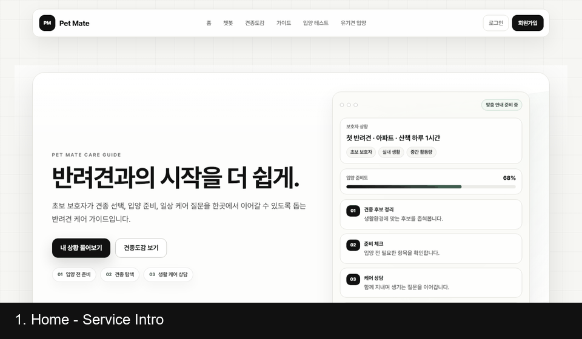

---

# **Contents**

1. [프로젝트 개요](#1-프로젝트-개요)
2. [기술 스택](#2-기술-스택)
3. [데이터 및 모델 선정](#3-데이터-및-모델-선정)
4. [시스템 아키텍처](#4-시스템-아키텍처)
5. [요구사항 정의서](#5-요구사항-명세서)
6. [화면 설계서](#6-화면-설계서)
7. [시연 화면](#7-시연-화면)
8. [테스트 시나리오 및 결과](#8-테스트-계획-및-결과-보고서)
9. [수행 결과](#9-수행-결과)
10. [서비스 개선 노력](#10-서비스-개선-노력)
11. [한계 및 향후 개선 방향](#11-한계-및-향후-개선-방향)
12. [실행 방법](#12-실행-방법)
13. [참고 문서](#13-참고-문서)
14. [팀원 회고](#14-팀원-회고)

---

## **1. 프로젝트 개요**

## **1.1 프로젝트 명**
**Pet Mate**

## **1.2 팀 소개**
### **팀명**: 뉴독쓰(NewDogs)

### **팀원 소개**
<table align="center" width="100%">
  <tr>
    <td align="center" width="20%"></td>
    <td align="center" width="20%"></td>
    <td align="center" width="20%"></td>
    <td align="center" width="20%"></td>
    <td align="center" width="20%"></td>
  </tr>
  <tr>
    <td align="center"><b>김주영</b></td>
    <td align="center"><b>문재경</b></td>
    <td align="center"><b>박준희</b></td>
    <td align="center"><b>신동혁</b></td>
    <td align="center"><b>오주희</b></td>
  </tr>
  <tr>
    <td align="center">팀원</td>
    <td align="center">팀원</td>
    <td align="center">팀원</td>
    <td align="center">팀원</td>
    <td align="center">팀원</td>
  </tr>
    <tr>
    <td align="center">데이터 수집 및 전처리, 발표</td>
    <td align="center">데이터 전처리 및 감독</td>
    <td align="center">데이터 수집 및 전처리, 에이전트, 시퀀스다이어그램</td>
    <td align="center">Django 구현, README 작성</td>
    <td align="center">데이터 수집 및 RAG, 발표</td>
  </tr>
</table>

## **1.3 프로젝트 소개**

본 프로젝트는 반려견 관련 정보를 단순히 나열하는 것이 아니라, 사용자가 입양을 준비하는 과정에서 필요한 기능을 단계적으로 사용할 수 있도록 구성하는 것을 목표로 했습니다.

- 반려견 양육과 입양 관련 질문은 챗봇에서 처리합니다.
- 견종별 성격, 크기, 활동량, 훈련성, 건강 정보는 견종도감에서 조회합니다.
- 입양 전 준비 상태는 입양 테스트로 확인합니다.
- 동물보호 API 기반 보호동물 데이터는 유기견 입양 화면에서 조회합니다.

## **1.4 프로젝트 배경 및 필요성**

### **1.4.1. 반려견 입양 정보의 분산**

- 반려견 입양 전 사용자는 준비물, 훈련, 생활 관리, 견종 특성, 보호동물 정보를 여러 사이트에서 따로 확인해야 합니다.
- 정보가 흩어져 있으면 초보 보호자는 무엇부터 확인해야 하는지 판단하기 어렵습니다.
- Pet Mate는 반려견 입양 전후에 필요한 핵심 정보를 하나의 서비스 흐름으로 연결합니다.

### **1.4.2. 초보 보호자의 의사결정 부담**

- 초보 보호자는 자신의 생활환경에 어떤 견종이 맞는지 판단하기 어렵습니다.
- 원룸 거주, 장시간 외출, 털빠짐, 짖음, 산책 시간 등 현실 조건을 함께 고려해야 합니다.
- Pet Mate는 견종 데이터와 반려견 케어 문서를 기반으로 사용자의 질문에 맞춘 안내를 제공합니다.

### **1.4.3. 실제 유기견 데이터와 추천 흐름의 연결 필요**

- 견종 추천이 실제 입양으로 이어지려면 현재 보호 중인 유기견 정보와 연결되어야 합니다.
- Pet Mate는 공공데이터포털 동물보호 API 데이터를 DB에 적재하고, 견종/지역/상태 필터로 조회할 수 있게 구성했습니다.
- 유기견 현황 표를 통해 전체, 보호중, 입양 완료, 기타 상태 건수를 확인할 수 있습니다.

## **1.5 프로젝트 목표**

### **[1] 근거 기반 반려견 케어 Q&A**

> 목표: 반려견 케어 문서와 견종 정보를 RAG로 연결해 질문에 맞는 답변을 제공

- 유튜브 Q&A, AKC 견종 데이터, 초보 보호자 가이드 문서를 검색 가능한 지식 기반으로 구성
- LangGraph workflow로 질문 분석, 문서 검색, 답변 생성 흐름 분리
- 답변에 활용된 출처를 함께 제공할 수 있는 구조 마련

### **[2] 사용자 조건 기반 견종 탐색**

> 목표: 사용자가 자신의 생활환경에 맞는 견종을 찾도록 지원

- 한글 견종 사전 `dog_breed_dictionary_ko` 테이블 기반 검색
- 견종 그룹, 원산지, 키워드 필터 제공
- 견종 상세 화면에서 성격, 운동량, 관리 난이도, 건강 정보를 제공

### **[3] 실제 유기견 입양 정보 연결**

> 목표: 추천과 탐색을 실제 보호동물 데이터로 이어지는 입양 흐름으로 확장

- 동물보호 API 데이터를 `shelter_animals` 테이블에 적재
- 유기견 입양 화면에서 견종, 지역, 상태별 필터 제공
- 보호동물 상세 모달, 보호소 전화 연결, 즐겨찾기 기능 제공

---

## **2. 기술 스택**

| 분류 | 기술 및 도구 |
| --- | --- |
| **Frontend** |    |
| **Backend** |   |
| **AI & RAG** |    |
| **Database** |   |
| **Data** |    |
| **Infrastructure** |   |

---

## **3. 데이터 및 모델 선정**
## **3.1 데이터 선정**

- **데이터 선정 방향**
  - Pet Mate의 주요 기능인 `견종도감`, `유기견 입양`, `가이드`, `챗봇 RAG`, `입양 테스트`에 직접 활용 가능한 데이터를 선정
  - 화면 출력용 정형 데이터와 챗봇 검색용 문서 데이터를 분리하여 구성
  - 사용자에게 신뢰도 높은 정보를 제공하기 위해 공공데이터, 공식 문서, 견종 전문 자료, 수의학 문서를 함께 활용
  - 데이터는 활용 목적에 따라 PostgreSQL, PGVector, JSON, static PDF 형태로 관리

---

### **3.1.1 데이터 활용 요약**

| 구분 | 주요 데이터 | 활용 기능 |
| --- | --- | --- |
| 견종 데이터 | 견종명, 이미지, 크기, 체중, 수명, 성격, 관리 정보 | 견종도감, 견종 상세, 챗봇 견종 추천 |
| 보호동물 데이터 | 유기동물 공고 정보, 보호소 정보, 이미지, 상태 정보 | 유기견 입양 목록, 필터, 즐겨찾기 |
| 가이드 데이터 | 입양 신청서, 입양 설문지, 공공예절, 재난 대응, 행동지도 문서 | 가이드 페이지, PDF 다운로드 |
| RAG 문서 데이터 | AKC, Merck, article, 유튜브 Q&A/교육 데이터 | 챗봇 근거 기반 답변 생성 |
| 퀴즈 데이터 | 반려견 Q&A 기반 OX/객관식 문항 | 입양 테스트, 지식 점검 |

---

### **3.1.2 데이터 출처**

| 데이터 구분 | 원천 출처 | 프로젝트 내 활용 위치 |
| --- | --- | --- |
| 견종 기본 정보 | TheDogAPI | `database/contents/dog_api/dog_images_110.json` |
| 견종 특성 정보 | API Ninjas Dogs API | `database/contents/dog_api/` |
| 견종 설명 정보 | American Kennel Club, AKC | `database/docs/akc_dog_info/`, `database/akc/` |
| 건강/수의학 문서 | Merck Veterinary Manual | `database/merck_vet/raw/*.json` |
| 반려견 article | AKC Expert Advice 등 반려견 전문 article | `database/docs/article_*.json`, `database/contents/expert_advice/` |
| 유튜브 Q&A 데이터 | 반려견 교육/수의학 관련 유튜브 콘텐츠 기반 가공 데이터 | `database/docs/youtube_qna/*.jsonl` |
| 유튜브 교육 데이터 | 반려견 기본 교육 및 수의학 지식 콘텐츠 | `database/docs/youtube/*.json` |
| 보호동물 데이터 | 공공데이터포털 유기동물 조회 API | `database/animal_protection/`, `shelter_animals` |
| 가이드 문서 | 입양/공공예절/재난 대응/행동지도 관련 공식 문서 | `database/guide/processed/`, `web/static/guide/pdfs/` |
| 퀴즈 데이터 | RAG/Q&A 문서 기반 내부 생성 문항 | `database/quiz/qna_quiz_bank.json` |

---

### **3.1.3 주요 외부 출처**

- **TheDogAPI**
  - URL: https://www.thedogapi.com/
  - 활용 내용
    - 견종 이미지
    - 영문 견종명
    - 품종 기본 정보

- **API Ninjas Dogs API**
  - URL: https://api-ninjas.com/api/dogs
  - 활용 내용
    - 견종별 키
    - 체중
    - 수명
    - 성격
    - 관리 특성

- **American Kennel Club, AKC**
  - URL: https://www.akc.org/dog-breeds/
  - 활용 내용
    - 견종별 공식 설명
    - 견종 그룹
    - 성격 및 관리 특성
    - RAG 검색 문서

- **Merck Veterinary Manual**
  - URL: https://www.merckvetmanual.com/
  - 활용 내용
    - 반려견 건강 정보
    - 질병 및 증상 설명
    - 수의학 기반 챗봇 답변 근거

- **공공데이터포털**
  - URL: https://www.data.go.kr/
  - 활용 내용
    - 유기동물 조회 API
    - 보호동물 공고 정보
    - 보호소 정보
    - 지역/상태/품종 기반 입양 데이터

---

### **3.1.4 데이터별 활용 방식**

- **견종 데이터**
  - 외부 API와 견종 설명 데이터를 조합하여 110종 견종 데이터 구성
  - 한국어 화면 제공을 위해 견종명, 성격, 상세 설명을 한국어 중심으로 정리
  - PostgreSQL의 `dog_breed_dictionary_ko` 테이블에 저장
  - 견종도감 목록, 상세 페이지, 챗봇 견종 추천에 활용

- **보호동물 데이터**
  - 공공데이터포털 유기동물 조회 API 응답을 수집
  - `desertion_no`를 기준으로 중복 데이터 관리
  - 품종, 지역, 보호상태, 보호소명, 연락처, 공고기간 정보를 정리
  - PostgreSQL의 `shelter_animals` 테이블에 저장
  - 유기견 입양 목록, 필터, 즐겨찾기 기능에 활용

- **가이드 데이터**
  - 공식 문서 기반 내용을 페이지별 가이드로 정리
  - 화면 표시용 본문 데이터와 다운로드용 PDF 파일을 분리하여 관리
  - `guide_sections.json`에는 페이지별 본문과 출처 정보를 저장
  - `web/static/guide/pdfs/`에는 다운로드용 PDF 파일을 배치

- **RAG 문서 데이터**
  - AKC, Merck, article, 유튜브 Q&A/교육 데이터를 문서 단위로 정리
  - 문서별 `source`, `title`, `category`, `source_file` 메타데이터 부여
  - 긴 문서는 청크 단위로 분할
  - OpenAI Embedding을 통해 벡터화
  - PGVector에 저장하여 챗봇 검색에 활용

- **퀴즈 데이터**
  - 반려견 Q&A 데이터를 기반으로 OX/객관식 문항 구성
  - `qna_quiz_bank.json`에 문항 데이터 저장
  - 입양 테스트에서 무작위 문항 출제
  - 사용자 결과 저장 및 마이페이지 기록 관리에 활용

---

## **4. 시스템 아키텍처**

## **4.1 전체 구조**

### **서비스 전체 구성**

```text
[사용자]
   ↓
[Django Web Service]
   ├─ 챗봇
   ├─ 견종도감
   ├─ 유기견 입양
   ├─ 가이드
   └─ 입양 테스트
   ↓
[AI/RAG Backend]
   ├─ 질문 분석
   ├─ 문서 검색
   └─ 답변 생성
   ↓
[PostgreSQL + PGVector]
   ├─ 견종 데이터
   ├─ 유기견 데이터
   ├─ 사용자/채팅 데이터
   └─ RAG 문서 벡터
```

### **프로젝트 폴더 구성**

```text
SKN27-4th-2team/
├─ backend/
│  ├─ agents/
│  ├─ integrations/
│  │  ├─ animal_protection/
│  │  └─ rag/
│  ├─ schemas/
│  └─ services/
├─ database/
│  ├─ akc/
│  ├─ animal_protection/
│  ├─ contents/
│  ├─ docs/
│  ├─ guide/
│  ├─ merck_vet/
│  ├─ tools/
│  └─ dumps/
├─ web/
│  ├─ chatbot/
│  ├─ dog/
│  ├─ guide/
│  ├─ shelter/
│  ├─ test/
│  ├─ user/
│  ├─ templates/
│  └─ static/
├─ docker-compose.yml
├─ requirements.txt
└─ README.md
```

## **4.2 데이터베이스 구조 및 ERD**

### 4.2.1. ERD

<p align="center">
  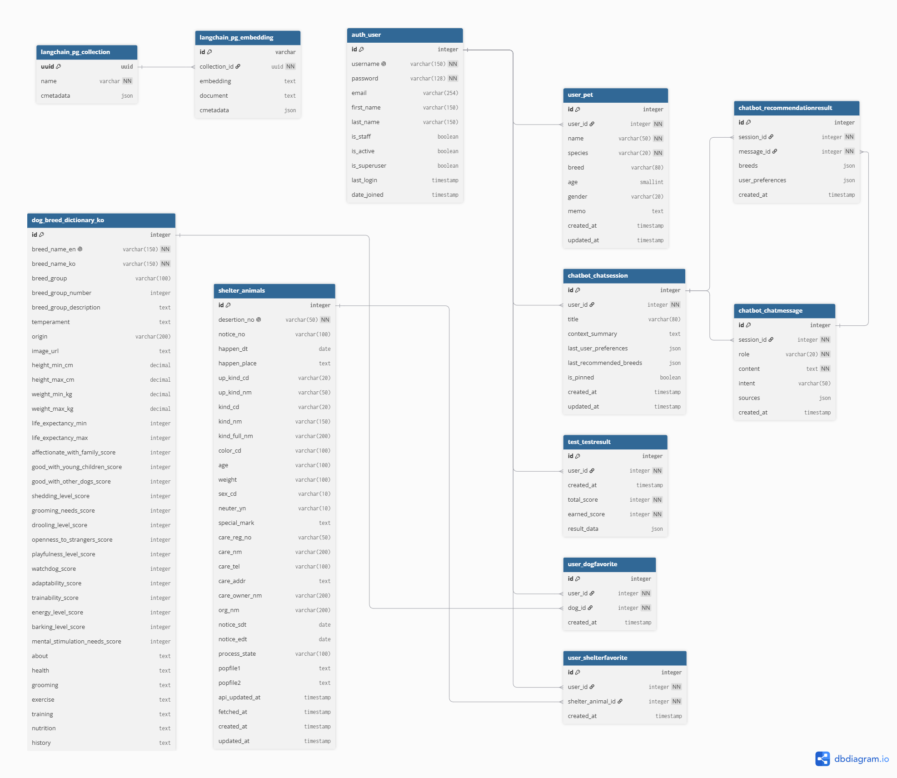
</p>

<p align="center">
  <sub>Pet Mate 데이터베이스 ERD</sub>
</p>


`langchain_pg_collection`과 `langchain_pg_embedding`: RAG 검색용 벡터 저장소

사용자, 채팅, 견종도감, 유기견 테이블과 직접 FK로 연결되지는 않지만, 챗봇이 질문을 처리할 때 `cmetadata`의 `source`, `title`, `breed_name`, `section` 정보를 활용해 검색 문서와 출처를 구성합니다.


### 4.2.2. 주요 테이블

| 테이블명 | 타입 | 설명 | 주요 역할 |
|---|---|---|---|
| **`dog_breed_dictionary_ko`** | RDB 테이블 | 110종의 한국어 번역 완료된 견종 백과 정보 | 견종도감 조회 및 견종 상세 필터링 |
| **`shelter_animals`** | RDB 테이블 | 공공 API에서 적재한 실시간 보호 동물 정보 | 유기견 조회, 지역/견종 필터링 및 현황 가시화 |
| **`langchain_pg_collection`** | VectorDB 관리 테이블 | PGVector 문서 임베딩 관리를 위한 컬렉션 테이블 | 벡터 DB 컬렉션 관리 |
| **`langchain_pg_embedding`** | VectorDB 데이터 테이블 | Merck 수의학 문서, 유튜브 Q&A 문서 등 임베딩 적재 테이블 | 챗봇 질문 시 시맨틱 검색 대상 문서 및 출처 정보 제공 |


## **4.3 시퀀스 다이어그램**

### 4.3.1. 챗봇 질문 처리 전체 흐름

사용자가 챗봇에 질문을 입력하면 웹 화면에서 서버로 질문이 전달되고, 서버는 챗봇 처리 엔진을 통해 관련 지식을 검색한 뒤 AI 모델에게 답변 생성을 요청합니다. 생성된 답변과 참고 정보는 다시 웹 화면에 표시됩니다.

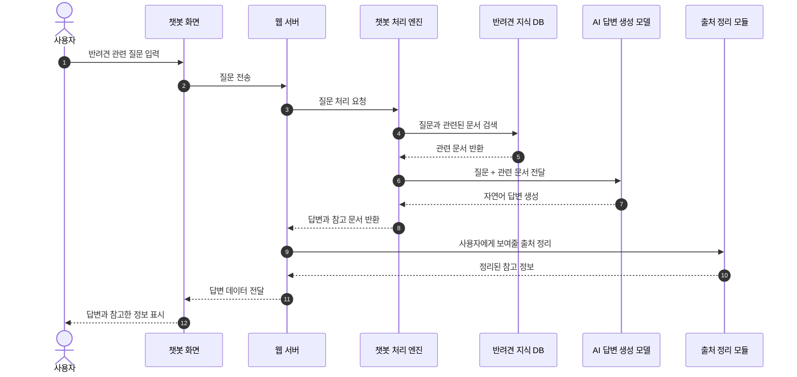

#### 설명

- 사용자는 웹 챗봇 화면에서 질문합니다.
- 서버는 질문을 그대로 AI에게 보내지 않고, 먼저 반려견 지식 DB에서 관련 자료를 찾습니다.
- AI 모델은 검색된 자료를 근거로 답변을 생성합니다.
- 사용자는 답변과 함께 참고한 정보를 확인할 수 있습니다.

---

### 4.3.2. 로그인 사용자 대화 저장 및 기억 활용 흐름

로그인한 사용자의 질문과 답변은 대화방 단위로 저장됩니다. 이후 사용자가 "아까 추천한 견종", "내가 키우는 강아지", "그중에서"처럼 후속 질문을 하면, 이전 대화 내용을 함께 참고해 답변합니다.

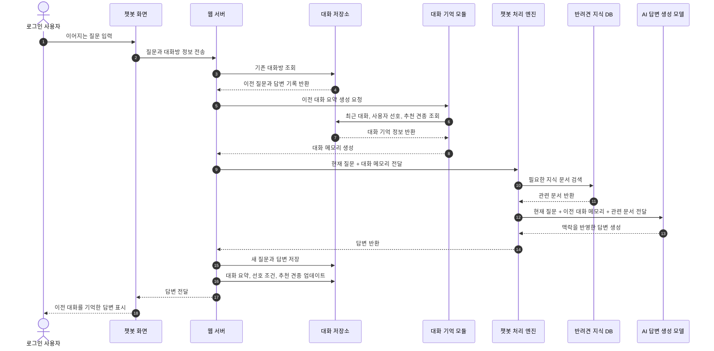

#### 설명

- 로그인 사용자는 대화 내역을 저장할 수 있습니다.
- 저장되는 정보는 단순 원문뿐 아니라 대화 요약, 최근 추천 견종, 사용자 선호 조건까지 포함됩니다.
- 이 정보는 다음 질문에서 AI 모델의 보조 맥락으로 사용됩니다.
- 예를 들어 사용자가 앞에서 "진돗개를 키운다"고 말한 뒤 "내가 키우는 개가 뭐라고?"라고 물으면, 챗봇은 이전 대화를 참고해 "진돗개"라고 답할 수 있습니다.

---

### 4.3.3. RAG 기반 답변 생성 흐름

Pet Mate 챗봇은 AI 모델에게 질문만 던지는 방식이 아닙니다. 먼저 질문을 분석하고, 반려견 지식 DB에서 관련 자료를 검색한 뒤, 그 자료를 AI 모델에게 함께 전달해 답변을 생성합니다. 이 구조를 RAG라고 합니다.

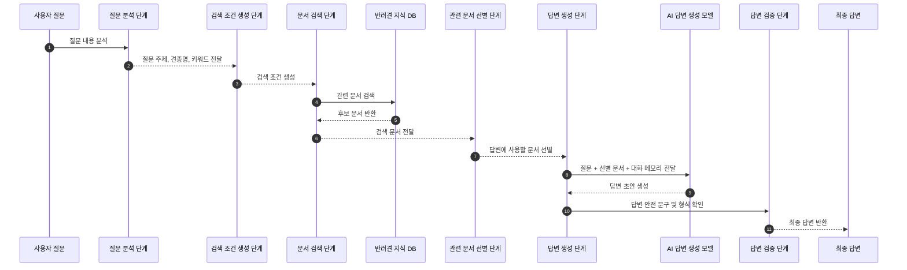

#### 설명

- 질문 분석 단계에서 사용자의 질문이 견종 추천인지, 특정 견종 질문인지, 일반 케어 상담인지 파악합니다.
- 검색 조건 생성 단계에서는 질문에 맞는 문서를 찾기 위한 조건을 만듭니다.
- 문서 검색 단계에서는 PostgreSQL과 pgvector에 저장된 반려견 문서를 검색합니다.
- AI 모델은 검색된 문서를 참고해 답변하므로, 단순 생성형 답변보다 근거 기반 답변을 제공할 수 있습니다.

---

### 4.3.4. 견종 추천 답변 생성 흐름

사용자가 생활환경이나 양육 경험을 바탕으로 견종 추천을 요청하면, 챗봇은 질문을 견종 추천 요청으로 판단하고 AKC 품종 정보를 검색합니다. 이후 AI 모델은 품종 특성, 활동량, 적응력, 훈련 난이도 등을 바탕으로 추천 답변을 생성합니다.

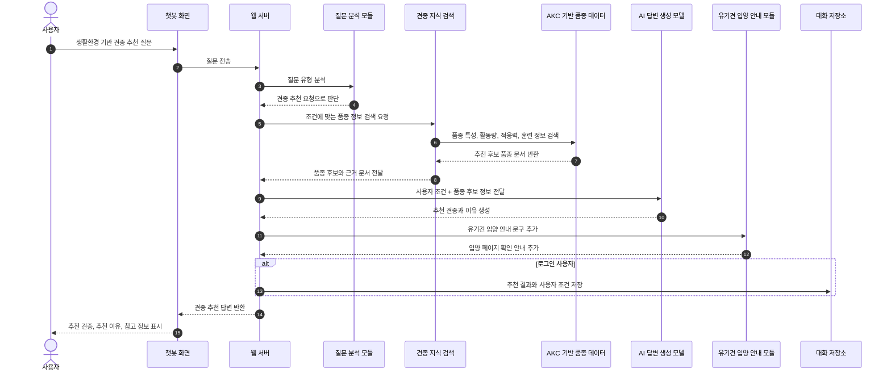

#### 설명

- 견종 추천 질문은 일반 상담과 별도로 인식됩니다.
- 추천은 AI가 임의로 만드는 것이 아니라, 수집된 품종 특성 데이터를 바탕으로 생성됩니다.
- 답변에는 품종별 특징, 활동량, 적응력, 훈련 가능성 등이 반영됩니다.
- 로그인 사용자의 경우 마지막 추천 견종이 저장되어, 이후 "그중에서 털이 덜 빠지는 견종은?" 같은 후속 질문에 활용할 수 있습니다.

---

## **5. 요구사항 정의서서**

## **5.1 기능 요구사항**

| ID | 요구사항 | 구현 여부 |
| --- | --- | --- |
| FR-001 | 사용자는 반려견 케어 질문을 챗봇에 입력할 수 있다 | 완료 |
| FR-002 | 챗봇은 RAG 기반 답변과 출처 정보를 제공한다 | 완료 |
| FR-003 | 사용자는 견종명, 그룹, 원산지로 견종을 검색할 수 있다 | 완료 |
| FR-004 | 사용자는 견종 상세 정보를 확인할 수 있다 | 완료 |
| FR-005 | 사용자는 입양 준비 테스트를 풀고 결과를 확인할 수 있다 | 완료 |
| FR-006 | 로그인 사용자는 테스트 결과를 저장할 수 있다 | 완료 |
| FR-007 | 사용자는 유기견 목록을 견종, 지역, 상태별로 필터링할 수 있다 | 완료 |
| FR-008 | 사용자는 보호동물 상세 정보와 보호소 연락처를 확인할 수 있다 | 완료 |
| FR-009 | 로그인 사용자는 견종와 보호동물을 즐겨찾기할 수 있다 | 완료 |
| FR-010 | 사용자는 가이드 원문 PDF를 확인할 수 있다 | 완료 |

## **5.2 비기능 요구사항**

| ID | 요구사항 | 구현 방향 |
| --- | --- | --- |
| NFR-001 | 데이터 조회 성능 | API 실시간 호출 대신 DB 적재 후 조회 |
| NFR-002 | 유지보수성 | Django 앱별 기능 분리, backend 서비스 계층 분리 |
| NFR-003 | 데이터 재생성 | `database/tools` 스크립트로 벡터, 퀴즈, 유기견 데이터 재생성 |
| NFR-004 | 확장성 | PGVector collection, ShelterAnimal 테이블 기반 확장 가능 |
| NFR-005 | 사용자 경험 | AJAX 필터, 모달, 즐겨찾기, 마이페이지 제공 |

---

## **6. 화면 설계서**


## **7. 시연 화면**


## **7.1 Home**

서비스의 핵심 흐름을 소개하고, 챗봇/견종도감/입양 테스트/유기견 입양 페이지로 이동할 수 있는 진입 화면입니다.

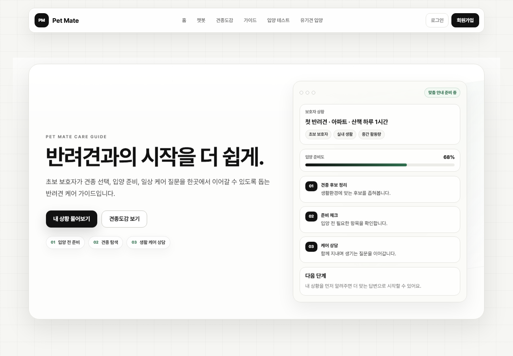

## **7.2 Chatbot**

반려견 케어 질문과 견종 추천 질문을 입력하면 RAG 워크플로우를 거쳐 답변을 생성하는 화면입니다.

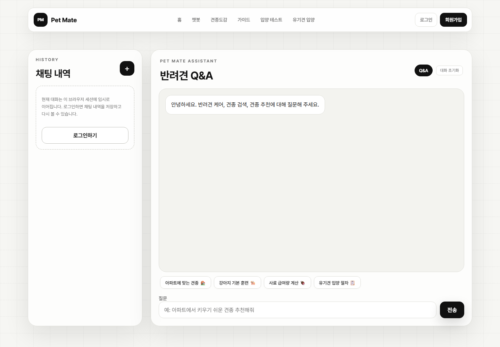

## **7.3 견종도감**

한글 견종 사전 기반으로 견종을 검색하고, 그룹/출신국가 조건으로 필터링할 수 있는 화면입니다.

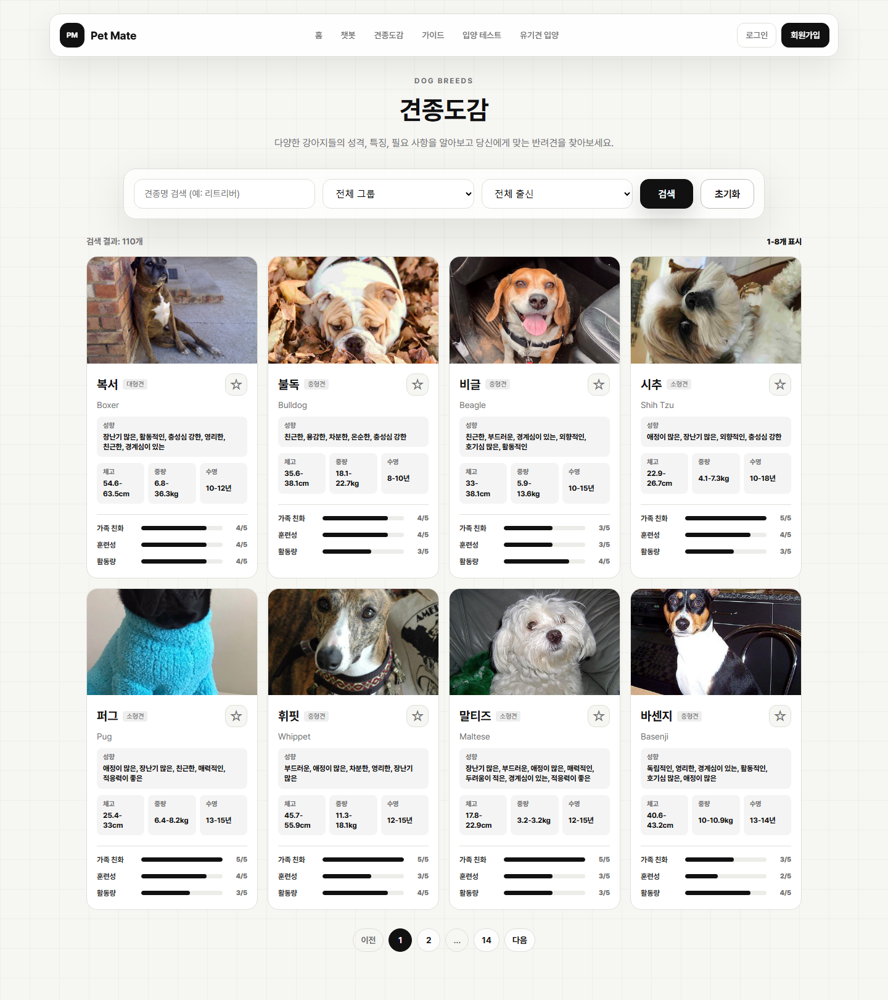

## **7.4 가이드**

입양 전 준비, 입양 신청, 공공예절, 재난 대응, 행동지도 등 초보 보호자에게 필요한 가이드와 원문 PDF 출처를 제공하는 화면입니다.

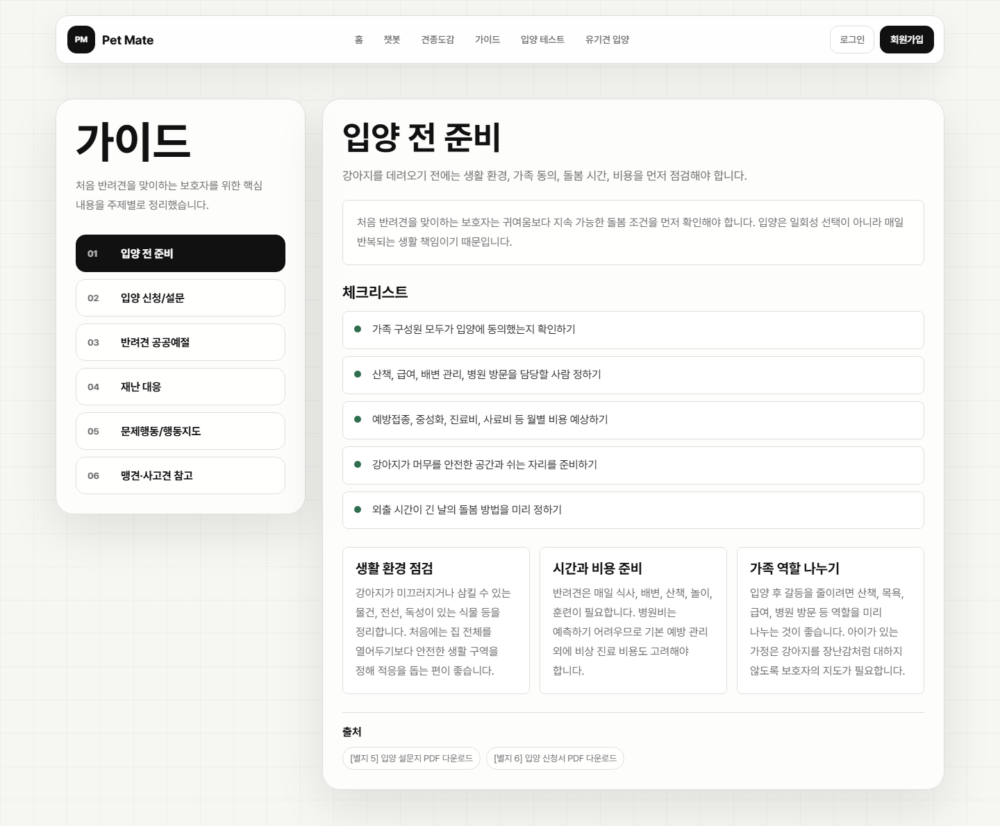

## **7.5 입양 테스트**

Q&A 기반 랜덤 퀴즈를 통해 입양 준비도를 점검하고, 로그인 사용자는 결과를 저장해 확인할 수 있습니다.

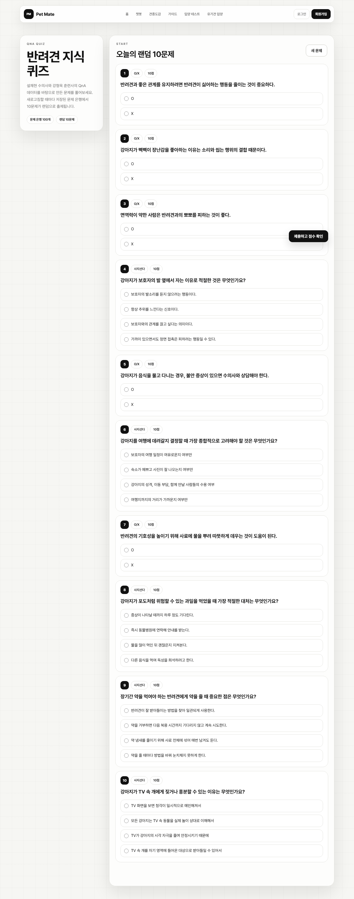

## **7.6 유기견 입양**

동물보호 API 기반 유기견 데이터를 견종/지역/상태별로 필터링하고, 현황 표와 보호동물 카드를 확인하는 화면입니다.

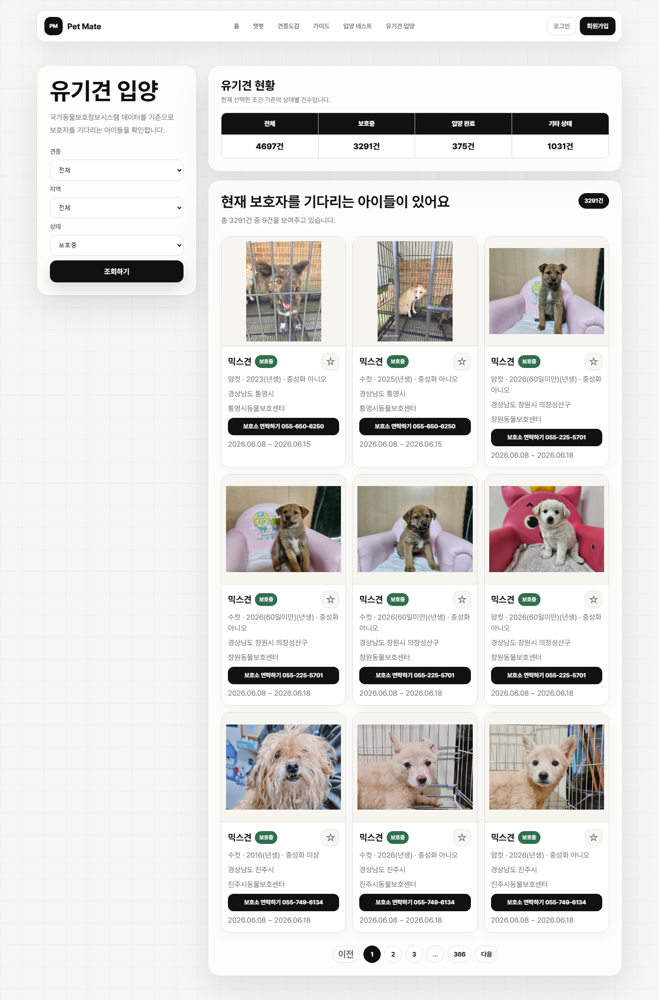

---

## **8. 테스트 시나리오 및 결과**

## 테스트 시나리오 결과 요약

| 총 시나리오 | Pass | Fail | 비고 |
| --- | --- | --- | --- |
| 6 | 6 | 0 | Django 시스템 체크 및 주요 화면 기능 검증 |

### TEST-001 · Django 시스템 체크

| 테스트 절차 | 기대 결과 | 결과 |
| --- | --- | --- |
| `python web/manage.py check` 실행 | Django 설정 오류 없음 | PASS |

### TEST-002 · 견종도감 검색

| 테스트 절차 | 기대 결과 | 결과 |
| --- | --- | --- |
| `/dog/breeds/`에서 키워드/그룹/원산지 필터 사용 | 조건에 맞는 견종 목록 출력 | PASS |

### TEST-003 · 챗봇 RAG 답변

| 테스트 절차 | 기대 결과 | 결과 |
| --- | --- | --- |
| 반려견 케어 질문 입력 | RAG workflow를 통한 답변 생성 | PASS |

### TEST-004 · 입양 테스트

| 테스트 절차 | 기대 결과 | 결과 |
| --- | --- | --- |
| `/test/`에서 퀴즈 제출 | 점수, 정답, 오답, 해설 출력 | PASS |

### TEST-005 · 유기견 필터 및 현황 표

| 테스트 절차 | 기대 결과 | 결과 |
| --- | --- | --- |
| `/shelter/`에서 상태/견종/지역 필터 사용 | 목록과 상태별 현황 표가 조건에 맞게 갱신 | PASS |

### TEST-006 · DB 상태별 건수 검증

| 테스트 절차 | 기대 결과 | 결과 |
| --- | --- | --- |
| `shelter_animals` 상태별 count 조회 | 화면의 전체/보호중/입양완료/기타 상태 수와 일치 | PASS |

---

## **9. 수행 결과**

## **9.1 구현 완료 기능**

- RAG 기반 반려견 케어 챗봇
- 한글 견종도감 검색 및 상세 페이지
- 초보 보호자 가이드 및 원문 PDF 링크
- 입양 준비 테스트 및 로그인 사용자 결과 저장
- 유기견 입양 목록, 필터, 상태별 현황 표
- 견종/보호동물 즐겨찾기
- 마이페이지 반려동물 관리
- PostgreSQL/PGVector 기반 데이터 저장 및 검색

---

## **10. 서비스 개선 노력**

### **개선 1. API 직접 호출 대신 DB 조회 중심 구조 적용**

- 유기견 목록은 공공 API를 화면에서 매번 호출하지 않고 `shelter_animals` 테이블에 적재한 뒤 조회합니다.
- 화면 렌더링 시 외부 API 응답 상태에 직접 의존하지 않도록 구성했습니다.

### **개선 2. RAG workflow 분리**

- 질문 분석, 검색 쿼리 생성, 문서 검색, 답변 생성을 `backend/agents`로 분리했습니다.
- 추후 검색 로직이나 검증 노드를 교체해도 전체 구조를 유지할 수 있습니다.

### **개선 3. 보호동물 현황 가시화**

- 유기견 입양 화면에 전체, 보호중, 입양 완료, 기타 상태 건수를 표로 제공했습니다.
- 필터 조건에 따라 현황 표도 함께 갱신되도록 구성했습니다.

### **개선 4. 데이터 재생성 스크립트 분리**

- 벡터스토어 적재, 퀴즈 생성, 유기견 데이터 적재를 각각 스크립트로 분리했습니다.
- 데이터 최신화와 재현성을 확보했습니다.

---

## **11. 한계 및 향후 개선 방향**

| 한계 | 개선 방향 |
| --- | --- |
| RAG 답변 품질은 적재 문서 품질과 OpenAI API 응답에 영향을 받음 | 문서 메타데이터 보강, 검색 결과 평가 로직 추가 |
| 유기견 데이터는 API 갱신 시점에 따라 실제 현황과 차이가 날 수 있음 | 주기적 적재 스케줄링, 마지막 갱신 시간 표시 |
| 견종 추천과 유기견 추천의 연결이 아직 제한적임 | 챗봇 추천 결과와 `shelter_animals` 자동 매칭 강화 |
| 위치 기반 입양 탐색이 부족함 | 보호소 위치 기반 거리순 정렬, 지도 연동 |
| 입양 신청 단계까지 직접 연결되지는 않음 | 보호소 상세 정보, 입양 신청서, 상담 절차 연결 |

---

## **12. 실행 방법**

### **환경 변수**

프로젝트 루트에 `.env` 파일을 생성하고 다음 값을 설정한다.

```env
OPENAI_API_KEY=
ANIMAL_API_SERVICE_KEY=
POSTGRES_DB=pet_dog
POSTGRES_USER=admin
POSTGRES_PASSWORD=
POSTGRES_HOST=localhost
POSTGRES_PORT=5432
```

### **데이터베이스 실행**

```bash
docker compose up -d
```

### **데이터 적재**

```bash
python database/tools/build_RDB.py
python database/tools/build_vectorstore.py --reset
python database/tools/build_shelter_animals_db.py --reset
```

### **웹 서버 실행**

```bash
python web/manage.py runserver
```

---

## **13. 참고 문서**

- **AKC Dog Breeds**: https://www.akc.org/dog-breeds/
- **한국애견연맹**: https://www.thekkf.or.kr/
- **TheDogAPI**: https://www.thedogapi.com/
- **API Ninjas Dogs API**: https://api-ninjas.com/api/dogs
- **동물보호 공공데이터 API**: https://www.data.go.kr/
- **Merck Veterinary Manual**: https://www.merckvetmanual.com/
- **LangChain**: https://www.langchain.com/
- **PGVector**: https://github.com/pgvector/pgvector

---

## **14. 팀원 회고**

| 팀원 | 회고 |
|---|---|
| 문재경 | |
| 박준희 | 처음으로 크롤링을 직접 수행하며 데이터를 수집했습니다. 크롤링 데이터 특성상 불필요한 텍스트, null 값, 수치 오류 등이 많았는데 이를 하나하나 확인하며 전처리해 견종 데이터를 완성했습니다. 데이터베이스 학습과 LangGraph 학습을 병행하면서 Agent를 구성하고 구현해낸 것도 의미 있는 경험이었습니다. 또한 이번 프로젝트를 통해 설계의 중요성을 다시한번 느낄 수 있었습니다. 초반 설계가 부족하면 데이터 수집·정리·전처리 단계에서 방향을 잃기 쉽고, 챗봇과 RDB 연결 시 대화 세션 관리를 처음부터 고려하지 않아 이후에 세션 구조를 추가로 고려하게 되었습니다. 배포 환경을 고려한 기능 설계도 필요했습니다. 견종 추천 결과에 따라 유기견 입양 페이지로 연결하려 했으나, 배포 전이라 도메인이 없어 실제 링크 연결이 불가능했습니다. 기능 범위를 정의할 때 배포 환경을 전제로 삼아야 한다는 것을 배웠습니다. 출처 표기 기준을 수집 전에 통일하지 않아, 출처마다 링크 연결 여부와 표기법이 달라졌습니다. 이후 일관되게 수정했지만, 수집 단계 전에 출처 형식 가이드를 먼저 정했다면 더 효율적이었을 것 같습니다. |
| 오주희 | 이번 프로젝트를 통해 데이터 수집부터 RAG 기반 챗봇 구현, 웹 서비스 연결까지 전체 흐름을 경험하며 사용자에게 필요한 정보를 하나의 서비스로 제공하는 과정의 중요성을 배웠습니다. |
| 신동혁 | 이번 프로젝트를 진행하며 견종도감과 유기견 입양 페이지를 구현한 과정이 가장 기억에 남았다. 견종도감에서는 검색, 필터, 페이지네이션을 적용해 많은 데이터를 보기 쉽게 구성했고, 즐겨찾기 기능을 통해 관심 있는 견종을 저장할 수 있도록 했다. 어려웠던 점은 Django의 View, Model, Template, JavaScript가 서로 연결되는 흐름을 맞추는 것이었다. 즐겨찾기 기능처럼 단순해 보이는 기능도 로그인 확인, DB 저장, JSON 응답, 화면 상태 변경이 모두 필요하다는 것을 경험했다. 이번 프로젝트를 통해 웹 개발은 단순히 화면을 만드는 것이 아니라, 데이터 흐름과 사용자 경험을 함께 고려해야 한다는 것을 배웠다. 다음 프로젝트에서는 코드 구조를 더 깔끔하게 분리하고, 예외 처리와 화면 문구의 일관성까지 더 신경 쓰고 싶다. |
| 김주영 | 강아지 견종 추천 서비스에서 데이터를 담당하며, 프로젝트의 전체 흐름에 대한 이해도를 높일 수 있었던 경험이었습니다. 유튜브 자막 데이터 크롤링과 데이터 전처리를 맡으면서, 하나의 데이터가 어떤 의미를 가지고 있으며, 어떻게 가공되어 최종적으로 화면에 출력되는지 이해할 수 있었습니다. 1, 2, 3번째 미니 프로젝트가 부족한 점을 인지하는 시간이었다면, 4번째 프로젝트는 제가 알고 있는 내용을 직접 적용해보고 이전의 부족했던 부분을 보완할 수 있었던 시간이었습니다. 특히 직접 API Key를 활용해 데이터를 호출하고, 그 안에서 발생한 오류 데이터를 교정하며, 우리 서비스에 맞게 데이터를 정제했던 과정이 가장 기억에 남습니다. 또한 LLM에는 다양한 모델이 존재하는데, 왜 특정 모델을 적용해야 하는지 그 선택의 흐름과 이유를 이해할 수 있었습니다. 다만 아쉬웠던 점도 있었습니다. 데이터를 최대한 깔끔하게 정제해야 한다는 점에 집중한 나머지, 서비스에 필요한 메타데이터까지 함께 제거했던 경험이 있었습니다. 이 경험을 통해 단순히 데이터를 정리하는 것뿐만 아니라, 이후 활용 목적까지 고려한 데이터 전처리가 중요하다는 것을 배웠습니다. 이번 프로젝트에서 느낀 아쉬운 점을 파이널 프로젝트에서 보완하며, 더욱 성장하고 싶습니다. |
