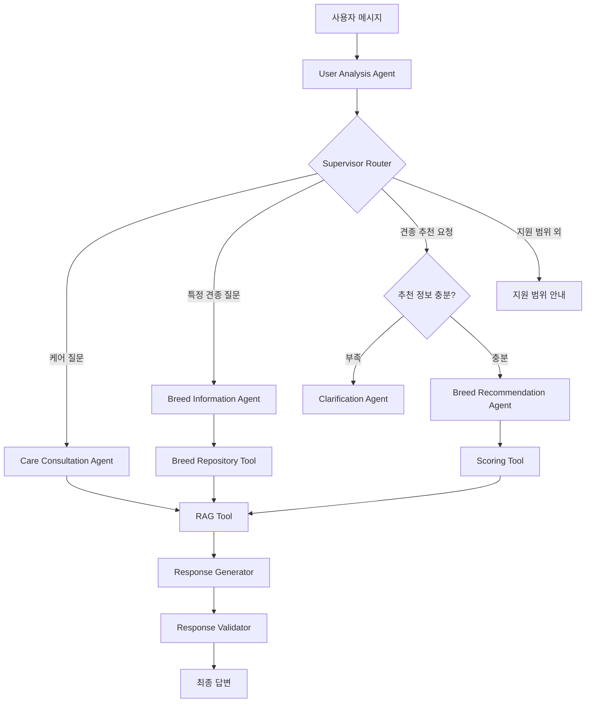

- Workflow

- 권장 파일 구성
backend/
├── agents/
│   ├── state.py
│   ├── graph.py
│   ├── supervisor.py
│   ├── user_analysis_agent.py
│   ├── care_consultation_agent.py
│   ├── breed_information_agent.py
│   ├── breed_recommendation_agent.py
│   ├── clarification_agent.py
│   └── response_validation_agent.py
│
├── tools/
│   ├── breed_repository.py
│   ├── breed_scoring.py
│   ├── profile_manager.py
│   └── rag_client.py
│
└── schemas/
    ├── user_profile.py
    ├── recommendation.py
    └── retrieved_document.py