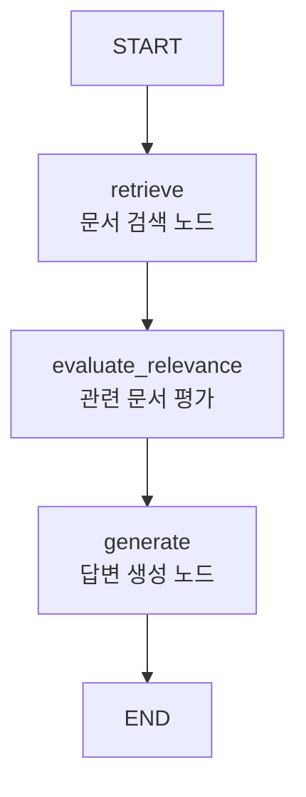

# Backend LangGraph RAG Workflow

현재 backend는 LangGraph 기반 RAG workflow로 구성한다.

케어 질문, 특정 견종 질문, 견종 추천 요청을 아직 분기하지 않고, 모든 사용자 메시지를 하나의 RAG 흐름으로 처리한다. RAG와 Vector DB는 다른 브랜치에서 작업 중이므로 현재는 `FakeRAGClient`를 통해 workflow 실행 구조를 먼저 검증한다.

## Workflow



## LangGraph 구성

`backend.agents.rag_workflow.create_rag_workflow()`에서 LangGraph를 생성한다.

```python
workflow = StateGraph(RAGState)

workflow.add_node("retrieve", retrieve)
workflow.add_node("evaluate_relevance", evaluate_relevance)
workflow.add_node("generate", generate)

workflow.add_edge(START, "retrieve")
workflow.add_edge("retrieve", "evaluate_relevance")
workflow.add_edge("evaluate_relevance", "generate")
workflow.add_edge("generate", END)

app = workflow.compile()
```

## 처리 순서

1. `backend.services.chat_service.handle_chat_message()`가 사용자 메시지를 받는다.
2. `backend.agents.rag_workflow.run_rag_workflow()`를 실행한다.
3. `create_rag_workflow()`가 `retrieve`, `evaluate_relevance`, `generate` 노드를 가진 LangGraph를 컴파일한다.
4. `retrieve` 노드가 사용자 질문을 분석하고 RAG 검색 요청을 만든다.
5. 현재는 `FakeRAGClient`가 임시 검색 문서를 반환한다.
6. `evaluate_relevance` 노드가 검색 문서 중 질문과 관련 있는 문서를 선별한다.
7. `generate` 노드가 관련 문서를 바탕으로 답변을 생성하고 기본 검증 문구를 보강한다.
8. 최종적으로 `ChatResponse`를 반환한다.

## 현재 파일 구성

```text
backend/
├── Workflow.md
├── __init__.py
│
├── agents/
│   ├── __init__.py
│   ├── rag_workflow.py
│   ├── rag_query_builder.py
│   ├── user_analysis_agent.py
│   ├── response_generator.py
│   └── response_validator.py
│
├── integrations/
│   ├── __init__.py
│   └── rag/
│       ├── __init__.py
│       ├── interface.py
│       ├── schemas.py
│       └── fake_client.py
│
├── schemas/
│   ├── __init__.py
│   ├── analysis.py
│   ├── chat.py
│   └── rag.py
│
└── services/
    ├── __init__.py
    └── chat_service.py
```

## 주요 파일 역할

### `services/chat_service.py`

Django view 또는 API에서 추후 호출할 서비스 진입점이다.

현재는 web과 연결하지 않았으며, 나중에 `web/chatbot/views.py`에서 `handle_chat_message()`를 호출하면 된다.

### `agents/rag_workflow.py`

LangGraph 기반 RAG workflow의 중심 파일이다.

다음 노드를 정의한다.

- `retrieve`
- `evaluate_relevance`
- `generate`

현재는 `run_rag_workflow()`가 workflow를 실행하고 `ChatResponse`로 변환해 반환한다.

### `agents/rag_query_builder.py`

`retrieve` 노드 안에서 사용한다.

사용자 질문 분석 결과를 실제 RAG 검색 요청으로 변환한다.

현재 생성하는 값은 다음과 같다.

- `query`
- `categories`
- `breed_names`
- `sections`
- `top_k`

### `schemas/rag.py`

LangGraph 노드 사이에서 공유되는 `RAGState`를 정의한다.

주요 상태 값은 다음과 같다.

- `question`
- `analysis`
- `retrieved_docs`
- `relevant_docs`
- `context`
- `answer`
- `sources`
- `relevance_issues`
- `validation_issues`

### `agents/user_analysis_agent.py`

`retrieve` 노드 안에서 사용자 메시지를 분석할 때 사용한다.

현재 추출 항목은 다음과 같다.

- 질문 요약
- 키워드
- 견종명
- 주제

### `integrations/rag/interface.py`

실제 RAG 구현체가 따라야 할 인터페이스를 정의한다.

RAG 담당 브랜치와 연결할 때 이 함수 규격을 맞춘다.

```python
search_documents(
    query: str,
    categories: list[str] | None = None,
    breed_names: list[str] | None = None,
    sections: list[str] | None = None,
    top_k: int = 5,
)
```

### `integrations/rag/fake_client.py`

실제 Vector DB가 연결되기 전까지 사용하는 임시 RAG client다.

현재는 테스트용 문서 하나를 반환한다.

### `agents/response_generator.py`

`generate` 노드에서 사용한다.

검색된 관련 문서와 사용자 질문을 바탕으로 답변 초안을 만든다.

현재는 LLM 연결 전 단계이므로 RAG 워크플로우 테스트용 응답 문구를 생성한다.

### `agents/response_validator.py`

`generate` 노드에서 사용한다.

답변 반환 전에 기본 안내 문구를 보강한다.

현재 적용되는 규칙은 다음과 같다.

- 답변이 비어 있으면 검증 실패로 처리
- 검색 문서가 없으면 근거 부족 안내 추가
- 건강·응급 관련 키워드가 있으면 수의사 또는 동물병원 상담 안내 추가
- 견종 추천 관련 키워드가 있으면 실제 개체별 차이가 있을 수 있다는 안내 추가

## Requirements

LangGraph workflow를 사용하므로 `requirements.txt`에 다음 패키지가 필요하다.

```text
langgraph
```

현재 `requirements.txt`에는 `langgraph`가 포함되어 있다.

## 추후 고도화 방향

1. `FakeRAGClient`를 실제 RAG client로 교체
2. `evaluate_relevance` 노드를 LLM 기반 YES/NO 평가 방식으로 교체
3. `generate` 노드를 LLM 기반 답변 생성 방식으로 교체
4. 대화 이력 저장 및 사용자 조건 누적
5. Supervisor Router 추가
6. 케어 상담, 견종 정보, 견종 추천 Agent 분리
7. AKC Trait 점수 기반 견종 추천 로직 추가
