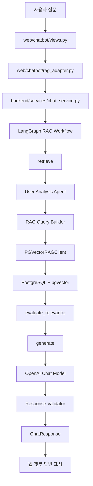
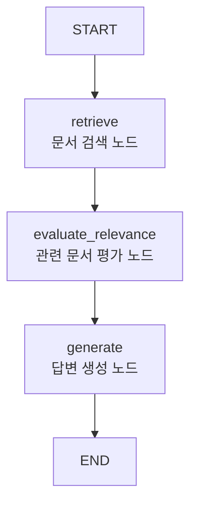

# Backend RAG Workflow

현재 backend는 LangGraph 기반 RAG workflow로 구성되어 있다.

사용자 질문이 들어오면 PostgreSQL + pgvector에 적재된 문서를 검색하고, 검색된 문서를 OpenAI Chat 모델에 함께 전달해서 자연어 답변을 생성한다. 즉, DB의 문서를 그대로 출력하는 구조가 아니라, 검색 결과를 근거로 LLM이 상담형 답변을 생성하는 구조다.

현재 기본 RAG client는 `PGVectorRAGClient`이며, `FakeRAGClient`는 테스트 또는 임시 실행용으로만 사용한다.

## Overall Flow



## LangGraph Workflow

`backend.agents.rag_workflow.create_rag_workflow()`에서 LangGraph workflow를 생성한다.

현재 그래프는 기본 RAG 흐름을 유지한다.



코드 구조는 다음과 같다.

```python
workflow = StateGraph(RAGState)

workflow.add_node("retrieve", _make_retrieve_node(client))
workflow.add_node("evaluate_relevance", evaluate_relevance)
workflow.add_node("generate", generate)

workflow.add_edge(START, "retrieve")
workflow.add_edge("retrieve", "evaluate_relevance")
workflow.add_edge("evaluate_relevance", "generate")
workflow.add_edge("generate", END)

return workflow.compile()
```

## Processing Steps

1. `web/chatbot/views.py`에서 사용자 메시지를 받는다.
2. `web/chatbot/rag_adapter.py`가 backend import path를 잡고 `handle_chat_message()`를 호출한다.
3. `backend/services/chat_service.py`에서 기본 client로 `PGVectorRAGClient`를 생성한다.
4. `backend/agents/rag_workflow.py`의 `run_rag_workflow()`가 LangGraph workflow를 실행한다.
5. `retrieve` 노드에서 사용자 질문을 분석하고 RAG 검색 요청을 만든다.
6. `PGVectorRAGClient`가 PostgreSQL `langchain_pg_embedding` 테이블에서 pgvector 유사도 검색을 수행하고, `langchain_pg_collection`으로 collection을 제한한다.
7. `evaluate_relevance` 노드가 검색된 문서를 답변 생성에 사용할 문서로 전달한다.
8. `generate` 노드가 검색 문서와 사용자 질문을 OpenAI Chat 모델에 전달해 답변을 생성한다.
9. `response_validator`가 기본 안내 문구와 안전성 관련 문구를 보강한다.
10. 최종적으로 `ChatResponse`가 반환되고, 웹 챗봇에 답변과 참고한 정보가 표시된다.

## Current File Structure

```text
backend/
├── Workflow.md
├── __init__.py
├── agents/
│   ├── __init__.py
│   ├── rag_workflow.py
│   ├── rag_query_builder.py
│   ├── user_analysis_agent.py
│   ├── response_generator.py
│   └── response_validator.py
├── integrations/
│   ├── __init__.py
│   └── rag/
│       ├── __init__.py
│       ├── interface.py
│       ├── schemas.py
│       ├── fake_client.py
│       └── pgvector_client.py
├── schemas/
│   ├── __init__.py
│   ├── analysis.py
│   ├── chat.py
│   └── rag.py
└── services/
    ├── __init__.py
    └── chat_service.py
```

## Main Files

### `services/chat_service.py`

웹, API, 테스트 코드에서 호출할 수 있는 backend 진입점이다.

현재 기본 동작은 다음과 같다.

- `rag_client`가 주입되지 않으면 `PGVectorRAGClient()`를 사용한다.
- `run_rag_workflow()`를 호출한다.
- 최종 결과로 `ChatResponse`를 반환한다.

`conversation_id` 인자는 추후 memory layer 연결을 위해 예약되어 있다.

### `agents/rag_workflow.py`

LangGraph RAG workflow의 중심 파일이다.

주요 노드는 다음과 같다.

- `retrieve`
- `evaluate_relevance`
- `generate`

현재 `evaluate_relevance`는 검색 결과를 그대로 통과시키는 기본 구조다. 이후 필요하면 LLM 기반 관련도 평가 또는 score threshold 기반 필터링으로 고도화할 수 있다.

### `agents/user_analysis_agent.py`

사용자 질문을 가볍게 분석한다.

현재 분석하는 주요 정보는 다음과 같다.

- 질문 요약
- 주제
- 키워드
- 감지된 견종명

예를 들어 말티즈, 푸들 같은 한국어 견종 표현을 AKC 데이터의 영문 breed name과 매핑하는 역할도 일부 수행한다.

### `agents/rag_query_builder.py`

사용자 질문 분석 결과를 실제 RAG 검색 요청으로 변환한다.

생성되는 값은 다음과 같다.

- `query`
- `categories`
- `breed_names`
- `sections`
- `top_k`

현재 `top_k` 기본값은 `5`다.

주제에 따라 검색할 section을 좁힌다.

예:

- `walking` → `exercise`
- `training` → `training`
- `grooming` → `grooming`
- `nutrition` → `nutrition`
- `health` → `health`
- `breed_recommendation` → `traits`, `exercise`, `training`, `grooming`

### `integrations/rag/interface.py`

RAG client가 따라야 할 공통 인터페이스를 정의한다.

```python
search_documents(
    query: str,
    categories: list[str] | None = None,
    breed_names: list[str] | None = None,
    sections: list[str] | None = None,
    top_k: int = 5,
)
```

이 인터페이스 덕분에 `PGVectorRAGClient`, `FakeRAGClient`를 같은 방식으로 주입할 수 있다.

### `integrations/rag/pgvector_client.py`

실제 PostgreSQL + pgvector 검색을 담당한다.

주요 역할은 다음과 같다.

- `.env`에서 OpenAI API key, embedding model, PostgreSQL 접속 정보를 읽는다.
- 사용자 query를 embedding vector로 변환한다.
- `langchain_pg_embedding` 테이블에서 vector similarity 검색을 수행한다.
- `langchain_pg_collection` 테이블과 join해 `dog_rag_documents` collection만 검색한다.
- `langchain_pg_embedding.cmetadata`의 문서 metadata를 정규화해서 source, title, breed, section 정보를 보강한다.
- 검색 결과를 `RetrievedDocument` 목록으로 반환한다.

견종 추천 중 일부 요청은 일반 vector similarity만 사용하지 않고 구조화된 scoring 로직을 사용한다.

예를 들어 아파트, 원룸, 실내 생활 관련 추천 질문은 다음 정보를 활용한다.

- 체중
- 적응력
- 에너지 레벨
- 짖는 정도
- 훈련성
- 정신적 자극 필요도

이 경우 반환되는 score는 vector similarity가 아니라 추천 적합도 점수다.

### `integrations/rag/fake_client.py`

테스트 또는 RAG 연결 전 임시 실행용 client다.

현재 실제 서비스 흐름에서는 기본적으로 `PGVectorRAGClient`를 사용한다.

### `integrations/rag/schemas.py`

RAG 검색 결과 문서 구조인 `RetrievedDocument`를 정의한다.

주요 필드는 다음과 같다.

- `document_id`
- `content`
- `score`
- `metadata`

### `schemas/rag.py`

LangGraph 노드 사이에서 공유하는 `RAGState`를 정의한다.

주요 상태 값은 다음과 같다.

- `question`
- `analysis`
- `retrieved_docs`
- `relevant_docs`
- `context`
- `answer`
- `sources`
- `relevance_issues`
- `validation_issues`

### `schemas/chat.py`

최종 챗봇 응답인 `ChatResponse`를 정의한다.

웹 챗봇은 이 응답에서 다음 값을 사용한다.

- `answer`
- `sources`
- `analysis`

### `schemas/analysis.py`

사용자 질문 분석 결과인 `UserAnalysisResult`를 정의한다.

주요 값은 다음과 같다.

- `summary`
- `topics`
- `keywords`
- `breed_names`

### `agents/response_generator.py`

OpenAI Chat 모델을 호출해 최종 답변 초안을 생성한다.

현재 구성은 다음과 같다.

- `langchain_openai.ChatOpenAI` 사용
- 기본 모델: `gpt-4o-mini`
- 환경변수 `OPENAI_CHAT_MODEL`이 있으면 해당 모델 사용
- `OPENAI_API_KEY`는 프로젝트 `.env`에서 로드
- temperature: `0.2`
- context 최대 길이: `MAX_CONTEXT_CHARS = 7000`

OpenAI 모델에는 다음 정보가 함께 전달된다.

- 사용자 질문
- 질문 분석 결과
- RAG 검색 문서
- 이전 relevance issue 또는 validation feedback

답변 하단의 출처 목록은 웹에서 별도로 처리하므로, LLM 본문에는 `[근거 1]` 같은 출처 목록을 반복하지 않도록 지시한다.

### `agents/response_validator.py`

LLM 답변 생성 이후 기본 검증과 안내 문구 보강을 수행한다.

현재 주요 역할은 다음과 같다.

- 답변이 비어 있으면 fallback 답변 생성
- 검색 근거가 없으면 근거 부족 안내 추가
- 건강, 응급 관련 질문이면 수의사 또는 동물병원 상담 권장 문구 추가
- 견종 추천 관련 질문이면 개체별 차이가 있을 수 있다는 안내 추가

## Web Chatbot Integration

웹 챗봇 연결은 `web/chatbot` 폴더에서 담당한다.

backend와 직접 연결되는 주요 파일은 다음과 같다.

```text
web/chatbot/
├── rag_adapter.py
├── views.py
└── conversation_state.py
```

### `web/chatbot/rag_adapter.py`

Django app에서 backend 모듈을 import할 수 있도록 project root를 `sys.path`에 추가하고, `backend.services.chat_service.handle_chat_message()`를 호출한다.

### `web/chatbot/views.py`

사용자 질문을 받아 RAG 응답을 생성하고, 답변과 출처를 저장한다.

현재 처리 흐름은 다음과 같다.

1. 사용자 질문 수신
2. `get_rag_response()` 호출
3. RAG 응답의 `analysis`, `sources`, `answer` 수신
4. 사용자에게 보여줄 출처만 `filter_display_sources()`로 필터링
5. `serialize_sources()`로 출처를 JSON 저장 형식으로 변환
6. `ChatMessage`에 답변과 sources 저장
7. 화면에 답변과 참고한 정보 표시

### `web/chatbot/conversation_state.py`

챗봇 대화 상태와 출처 표시 형식을 관리한다.

주요 역할은 다음과 같다.

- RAG source를 사용자 화면에 보여줄 title/url 형태로 변환
- 질문과 같은 주제라고 판단되는 출처만 표시용으로 필터링
- 세션의 최근 질문, topic, 감지 견종, 추천 견종 정보를 저장

출처 표시는 다음 원칙을 따른다.

- AKC 품종 문서 → `AKC - Maltese / Training`
- YouTube 문서 → `YouTube - 채널명 / 영상 제목`
- YouTube Q&A 문서 → `YouTube Q&A - 강형욱 Q&A / 질문 제목`
- article 문서 → `Article - 제목`

사용자 화면에는 score를 보여주지 않는다. 다만 내부 `sources` JSON에는 score를 남겨 개발 검증용으로 활용할 수 있다.

## Source Display Policy

RAG 검색은 기본적으로 여러 문서를 가져오지만, 사용자에게 모든 검색 문서를 그대로 보여주지는 않는다.

현재 정책은 다음과 같다.

- 답변 생성에는 검색된 관련 문서를 사용한다.
- 사용자 화면에는 질문과 같은 주제로 판단되는 출처만 표시한다.
- 특정 견종 질문이면 같은 견종 문서를 유지한다.
- 견종 추천 질문이면 추천 후보 문서를 유지한다.
- 일반 상담 또는 Q&A는 질문 핵심 키워드와 제목/본문이 충분히 겹치는 문서만 표시한다.
- score는 사용자에게 숨긴다.

## Environment Variables

현재 workflow에서 중요한 환경변수는 다음과 같다.

```text
OPENAI_API_KEY
OPENAI_CHAT_MODEL
OPENAI_EMBEDDING_MODEL
POSTGRES_HOST
POSTGRES_PORT
POSTGRES_DB
POSTGRES_USER
POSTGRES_PASSWORD
RAG_TABLE
```

`OPENAI_CHAT_MODEL`을 지정하지 않으면 기본값으로 `gpt-4o-mini`를 사용한다.

## Requirements

현재 workflow에 필요한 주요 패키지는 다음 계열이다.

```text
langgraph
langchain-openai
openai
psycopg
pgvector
python-dotenv
```

정확한 버전과 전체 패키지 목록은 프로젝트의 `requirements.txt`를 기준으로 한다.

## Current Status

현재 완료된 부분은 다음과 같다.

- LangGraph RAG workflow 구성
- PostgreSQL + pgvector 검색 연결
- OpenAI Chat 모델 기반 답변 생성
- Django 웹 챗봇 연결
- 답변 저장
- 사용자 화면 출처 표시
- 출처 score 숨김
- 질문과 같은 주제의 출처만 사용자에게 표시
- 아파트/원룸 등 일부 견종 추천 질문에 대한 구조화 scoring 검색

## Future Improvements

향후 고도화 방향은 다음과 같다.

1. `evaluate_relevance` 노드를 LLM 기반 관련도 평가로 개선
2. 답변에 실제로 사용된 문장 단위 source attribution 강화
3. 견종 추천 전용 scoring tool 분리
4. 사용자 선호 정보 memory layer 추가
5. Supervisor Router 추가
6. Care Consultation Agent, Breed Information Agent, Breed Recommendation Agent 분리
7. 건강/응급 질문에 대한 validator 강화
8. 대화 흐름 기반 follow-up question 생성
