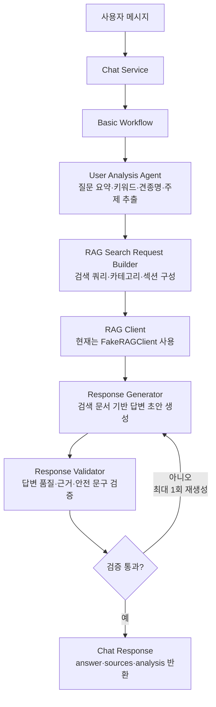

# Backend Basic Workflow

현재 단계에서는 케어 질문, 특정 견종 질문, 견종 추천 요청을 분기하지 않고 하나의 일자형 workflow로 처리한다.

RAG와 Vector DB는 다른 브랜치에서 작업 중이므로, 현재 backend 코드는 `FakeRAGClient`를 사용해 챗봇 처리 흐름만 먼저 검증한다. 추후 실제 RAG 구현체가 준비되면 `backend.integrations.rag.interface.RAGClient` 규격에 맞춰 교체한다.

## Workflow



## 처리 순서

1. `backend.services.chat_service.handle_chat_message()`가 사용자 메시지를 받는다.
2. `backend.agents.basic_workflow.run_basic_chat_workflow()`를 실행한다.
3. `User Analysis Agent`가 질문 요약, 키워드, 견종명, 주제를 추출한다.
4. 분석 결과를 바탕으로 RAG 검색 요청을 만든다.
5. 현재는 `FakeRAGClient`가 임시 검색 문서를 반환한다.
6. `Response Generator`가 사용자 질문과 검색 문서를 바탕으로 답변 초안을 만든다.
7. `Response Validator`가 답변이 비어 있거나 근거 문서가 부족한지 검증한다.
8. 검증에 실패하면 발견된 문제를 `Response Generator`에 전달해 최대 1회 답변을 다시 생성한다.
9. 검증을 통과하거나 재시도 한도에 도달하면 건강 관련 주의 문구, 견종 추천 관련 안내 문구를 보강한다.
10. 최종적으로 `ChatResponse`를 반환한다.

## 현재 파일 구성

```text
backend/
├── Workflow.md
├── __init__.py
│
├── agents/
│   ├── __init__.py
│   ├── basic_workflow.py
│   ├── user_analysis_agent.py
│   ├── response_generator.py
│   └── response_validator.py
│
├── integrations/
│   ├── __init__.py
│   └── rag/
│       ├── __init__.py
│       ├── interface.py
│       ├── schemas.py
│       └── fake_client.py
│
├── schemas/
│   ├── __init__.py
│   ├── analysis.py
│   └── chat.py
│
└── services/
    ├── __init__.py
    └── chat_service.py
```

## 주요 파일 역할

### `services/chat_service.py`

Django view 또는 API에서 추후 호출할 서비스 진입점이다.

현재는 web과 연결하지 않았으며, 나중에 `web/chatbot/views.py`에서 이 파일의 `handle_chat_message()`를 호출하면 된다.

### `agents/basic_workflow.py`

Basic Workflow의 중심 파일이다.

다음 흐름을 한 번에 실행한다.

```text
질문 분석
→ RAG 검색 요청 생성
→ RAG client 호출
→ 답변 생성
→ 답변 검증
→ 검증 실패 시 최대 1회 답변 재생성
→ ChatResponse 반환
```

### `agents/user_analysis_agent.py`

사용자 메시지에서 검색에 필요한 기본 정보를 추출한다.

현재 추출 항목은 다음과 같다.

- 질문 요약
- 키워드
- 견종명
- 주제

### `integrations/rag/interface.py`

실제 RAG 구현체가 따라야 할 인터페이스를 정의한다.

RAG 담당 브랜치와 연결할 때 이 함수 규격을 맞추면 된다.

```python
search_documents(
    query: str,
    categories: list[str] | None = None,
    breed_names: list[str] | None = None,
    sections: list[str] | None = None,
    top_k: int = 5,
)
```

### `integrations/rag/fake_client.py`

실제 Vector DB가 연결되기 전까지 사용하는 임시 RAG client다.

현재는 테스트용 문서 하나를 반환한다.

### `agents/response_generator.py`

검색된 문서와 사용자 질문을 바탕으로 답변 초안을 만든다.

현재는 LLM 연결 전 단계이므로 Basic Workflow 테스트용 응답 문구를 생성한다.

### `agents/response_validator.py`

답변 반환 전에 기본 안내 문구를 보강한다.

현재 적용되는 규칙은 다음과 같다.

- 답변이 비어 있으면 검증 실패로 처리
- 검색 문서가 없으면 검증 실패로 처리하고 재생성 요청
- 건강·응급 관련 키워드가 있으면 수의사 또는 동물병원 상담 안내 추가
- 견종 추천 관련 키워드가 있으면 실제 개체별 차이가 있을 수 있다는 안내 추가
- 재생성은 현재 Basic Workflow에서 최대 1회 수행

## 추후 고도화 방향

Basic Workflow가 web 챗봇과 연결된 뒤 다음 순서로 고도화한다.

1. `FakeRAGClient`를 실제 RAG client로 교체
2. LLM 기반 답변 생성 연결
3. 대화 이력 저장 및 사용자 조건 누적
4. Supervisor Router 추가
5. 케어 상담, 견종 정보, 견종 추천 Agent 분리
6. AKC Trait 점수 기반 견종 추천 로직 추가
