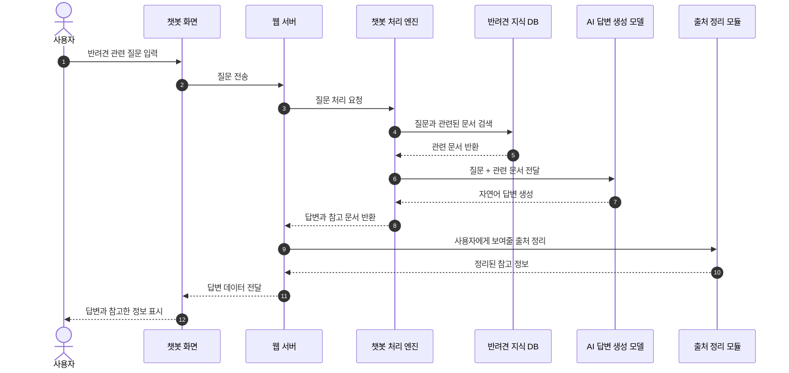
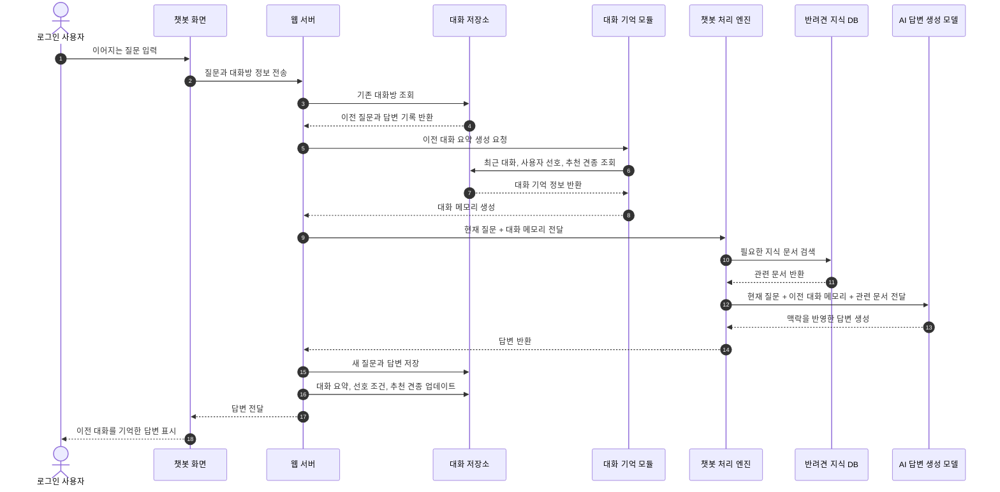
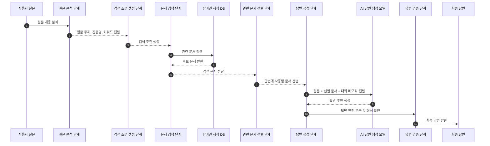
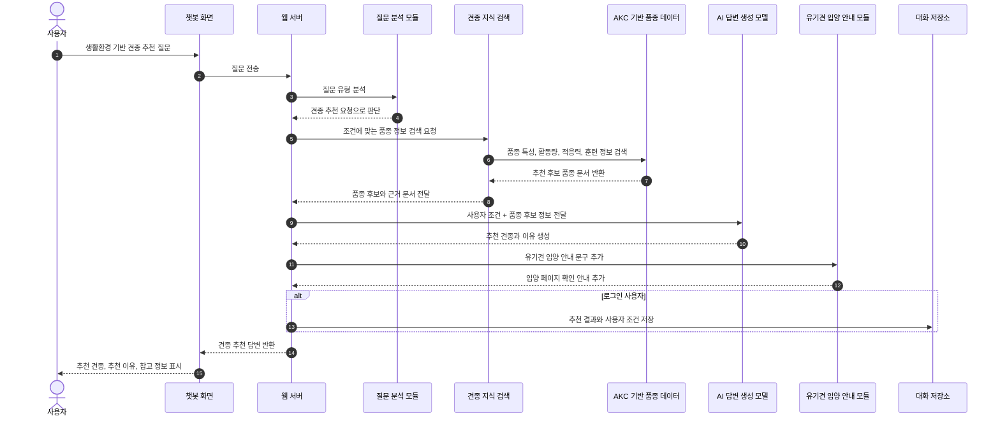

# Pet Mate 발표용 시퀀스 다이어그램

이 문서는 Pet Mate 서비스가 사용자 질문을 받고, 반려견 지식 데이터와 AI 모델을 활용해 답변을 생성하며, 웹 화면에 결과를 보여주는 흐름을 발표용으로 설명하기 위해 작성되었습니다.

다이어그램은 내부 함수명보다 역할 중심으로 표현했습니다.

## 1. 챗봇 질문 처리 전체 흐름

사용자가 챗봇에 질문을 입력하면 웹 화면에서 서버로 질문이 전달되고, 서버는 챗봇 처리 엔진을 통해 관련 지식을 검색한 뒤 AI 모델에게 답변 생성을 요청합니다. 생성된 답변과 참고 정보는 다시 웹 화면에 표시됩니다.

### 설명

- 사용자는 웹 챗봇 화면에서 질문합니다.
- 서버는 질문을 그대로 AI에게 보내지 않고, 먼저 반려견 지식 DB에서 관련 자료를 찾습니다.
- AI 모델은 검색된 자료를 근거로 답변을 생성합니다.
- 사용자는 답변과 함께 참고한 정보를 확인할 수 있습니다.

---

## 2. 로그인 사용자 대화 저장 및 기억 활용 흐름

로그인한 사용자의 질문과 답변은 대화방 단위로 저장됩니다. 이후 사용자가 "아까 추천한 견종", "내가 키우는 강아지", "그중에서"처럼 후속 질문을 하면, 이전 대화 내용을 함께 참고해 답변합니다.

### 설명

- 로그인 사용자는 대화 내역을 저장할 수 있습니다.
- 저장되는 정보는 단순 원문뿐 아니라 대화 요약, 최근 추천 견종, 사용자 선호 조건까지 포함됩니다.
- 이 정보는 다음 질문에서 AI 모델의 보조 맥락으로 사용됩니다.
- 예를 들어 사용자가 앞에서 "진돗개를 키운다"고 말한 뒤 "내가 키우는 개가 뭐라고?"라고 물으면, 챗봇은 이전 대화를 참고해 "진돗개"라고 답할 수 있습니다.

---

## 3. RAG 기반 답변 생성 흐름

Pet Mate 챗봇은 AI 모델에게 질문만 던지는 방식이 아닙니다. 먼저 질문을 분석하고, 반려견 지식 DB에서 관련 자료를 검색한 뒤, 그 자료를 AI 모델에게 함께 전달해 답변을 생성합니다. 이 구조를 RAG라고 합니다.

### 설명

- 질문 분석 단계에서 사용자의 질문이 견종 추천인지, 특정 견종 질문인지, 일반 케어 상담인지 파악합니다.
- 검색 조건 생성 단계에서는 질문에 맞는 문서를 찾기 위한 조건을 만듭니다.
- 문서 검색 단계에서는 PostgreSQL과 pgvector에 저장된 반려견 문서를 검색합니다.
- AI 모델은 검색된 문서를 참고해 답변하므로, 단순 생성형 답변보다 근거 기반 답변을 제공할 수 있습니다.

---

## 4. 견종 추천 답변 생성 흐름

사용자가 생활환경이나 양육 경험을 바탕으로 견종 추천을 요청하면, 챗봇은 질문을 견종 추천 요청으로 판단하고 AKC 품종 정보를 검색합니다. 이후 AI 모델은 품종 특성, 활동량, 적응력, 훈련 난이도 등을 바탕으로 추천 답변을 생성합니다.

### 설명

- 견종 추천 질문은 일반 상담과 별도로 감지됩니다.
- 추천은 AI가 임의로 만드는 것이 아니라, 수집된 품종 특성 데이터를 바탕으로 생성됩니다.
- 답변에는 품종별 특징, 활동량, 적응력, 훈련 가능성 등이 반영됩니다.
- 로그인 사용자의 경우 마지막 추천 견종이 저장되어, 이후 "그중에서 털이 덜 빠지는 견종은?" 같은 후속 질문에 활용할 수 있습니다.

